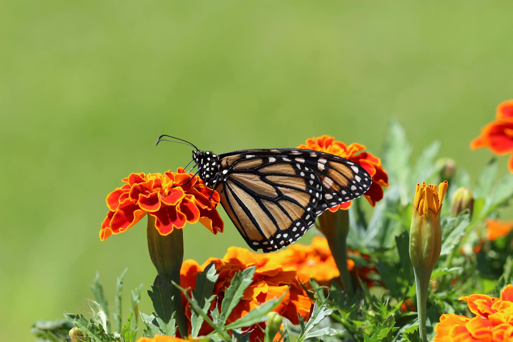
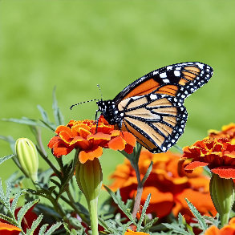
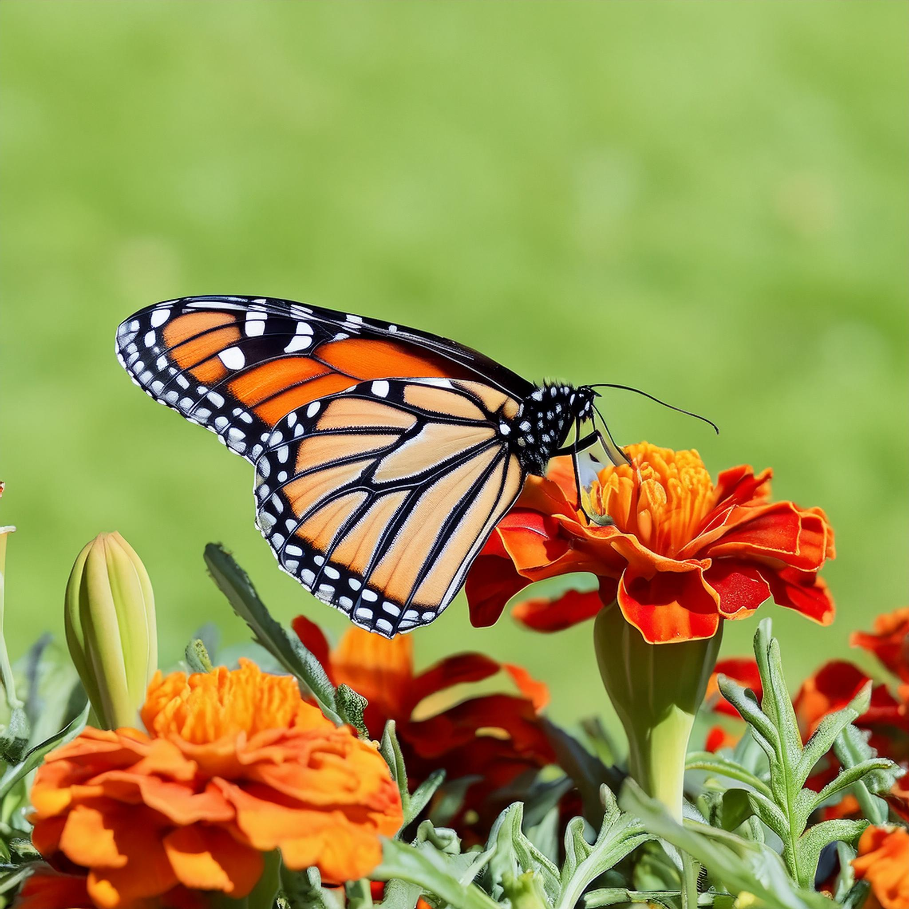
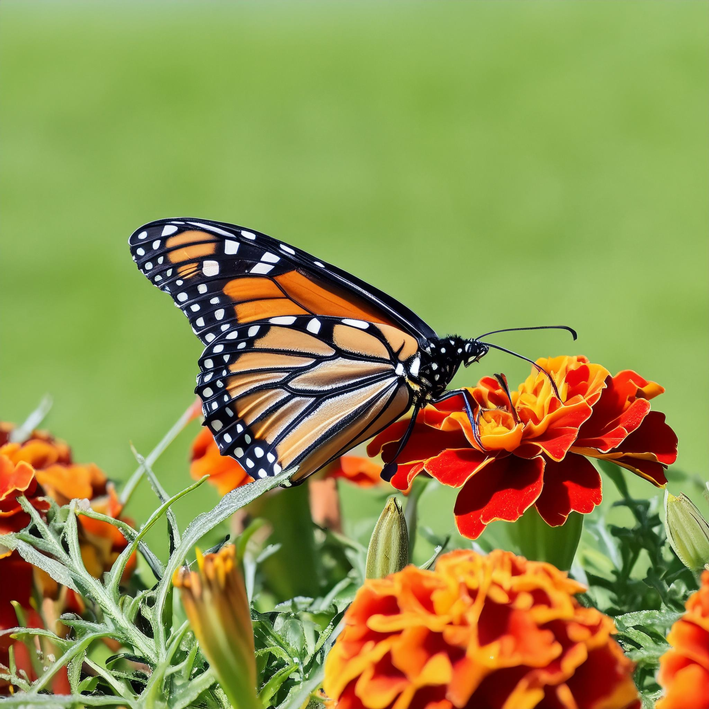

# Overview

This document provides an overview of the changes and new APIs introduced with the Firefly Image 3 Model support. A quick summary is provided, followed by a more detailed description of what's new as well as a list of terminology to use for reference while using the updated/new APIs and parameters.

## Firefly Image 3 Model (Preview) Benefits

- Improved generation quality with better depiction of details and more photorealistic results.
- Greater variety in generated outputs from a single prompt for photos, art, or flat illustrations.
- Improved ability to take reference images into account – both for stylization and for structure matching.
- Better understanding of prompts and compositions of complex scenes and text rendering.
- Improved image variations with varied options for composition, mood, and lighting.

** See [this link](https://helpx.adobe.com/firefly/using/whats-new.html) for more details on what's new.

### New Firefly APIs

The following new Firefly APIs were added and use the new v3 model:

- **[Generate Similar Images](../api/generate-similar/):** Pass in a source image to use as a reference for generating similar image results.
- **[Generate Object Composite](../api/generate-object-composite/):** Upload an image (with or without mask), such as a product photo, and utilize a text prompt to generate a seamlessly composited scene featuring the product. Object Composites enable users to upload an image of an object, guaranteeing pixel accuracy of the object, and generate a background using a reference image and a text prompt to influence the style and content of the background. See [this link](https://helpx.adobe.com/firefly/using/whats-new/2024-3.html#object-composites) for more specific details.

### Updated Firefly APIs

The following existing Firefly APIs were updated to use the new v3 model, and have new and/or renamed parameters:

- **[Generate Images API](../api/image_generation/):**

  - The `n` parameter has been renamed to `numVariations`
  - The `styles` object parameter was renamed to `style` and contains renamed child parameters as well. You can still supply a reference image to be used, but it should now be passed as `url` (for a presigned image URL), or `uploadId` for an uploaded image within the `imageReference.source` field:

  ```json
  style": {
      "presets": [
          "bw"
      ],
      "imageReference": {
          "source": {
              "url": "https://example.com/",
              "uploadId": "string"
          }
      }
      "strength": 50,
  }
  ```

  - The `photoSettings` parameter has been removed locale  has been renamed to `promptBiasingLocaleCode`.

- **[Expand Image](../api/generative_expand/):**

  - The `n` parameter has been renamed to `numVariations`
  - `locale` has been renamed to `promptBiasingLocaleCode`
  - The `image` parameter now has a `source` and a `mask` that can be provided as sub-parameters in the form of either an `uploadId` of an uploaded image (ie: `image.source.uploadId` or `image.mask.uploadId`, or a url for a presigned URL (ie: `image.source.url` or `image.mask.url`):

  ```json
  "image": {
      "source": {
        "url": "https://example.com/",
        "uploadId": "string"
      },
      "mask": {
        "url": "https://example.com/",
        "uploadId": "string"
      }
  }
  ```

  - A new `placement` object parameter can be specified, with `insets` and `alignment` child parameter values that can be provided. See the placement section below for more details.

- **[Fill Image](../api/generative_fill/):**

  - The `n` parameter has been renamed to `numVariations`
  - `locale` has been renamed to `promptBiasingLocaleCode`
  ​- Support for a `negativePrompt` parameter has been added
  - The `image` parameter now contains both the `source` parameter for the `image` input, and the `mask` parameter for the mask to use. (The previous version of the API had `mask` at the same level as the `image` parameter). Please note, for both, you can supply either a `url` (for a presigned URL – ie: `image.source.url` or `image.mask.url`) or an `uploadId` (for an uploaded image – ie: `image.source.uploadId` or `image.mask.uploadId`):

  ```json
  "image": {
      "source": {
        "url": "https://example.com/",
        "uploadId": "string"
      },
      "mask": {
        "url": "https://example.com/",
        "uploadId": "string"
      }
  }
  ```

  See [this link](https://helpx.adobe.com/firefly/using/generative-expand.html)for more details about the capabilities available for expanding and filling images with Firefly Image Model 3.

### Firefly API Details & Sample Calls

#### Generate Images

Generate images based on a prompt, with optional [preset](https://developer.adobe.com/firefly-services/docs/firefly-api/guides/concepts/styles/) values and reference images to optionally match the style or structure of other source images.

**Example**<br/>

**Prompt:** The giant magical dog, sniffing flowers on the forest floor. Fireflies everywhere. A spring of water. Long moss hanging from the tree branches. Moonlight.


#### [Generate Similar Images](../api/generate-similar/)

Provide a source image to use as a reference for generating similar image results.

**Example**<br/>

**Input**<br/>

<!--  -->


**Output**<br/>

<!--  -->


<!--  -->




<!--  -->

#### Expand Image

Expand an image by automatically filling it with Firefly-generated content that seamlessly blends with the existing image, or, use a descriptive prompt to get a more specific result. (Also known as "outpainting").

**Example**<br/>

This example shows how you can extend the canvas with a beach

**Prompt:** Sandy 

#### Fill Image

Fill in a designated region of an image by specifying a descriptive prompt, or skip the prompt and the area will be filled in with new content that seamlessly blends in with the surrounding image automatically. (Also known as "inpainting"). Note: The input is the original Image to be altered, along with a mask of the region that needs to be altered and a text prompt describing the change that needs to be made. 

Example: Add a cruise ship to a picture of an ocean and lighthouse.

#### Generate Object Composite

Upload an image (with or without mask), such as a product photo, and utilize a text prompt to generate a seamlessly composited scene featuring the product. 

Object Composites enable users to upload an image of an object, guaranteeing pixel accuracy of the object, and generate a background using a reference image and a text prompt to influence the style and content of the background.

Example

Input image and mask source:

**Prompt:** A luxurious background with a satin pillow and falling rose petals

Style [preset](https://developer.adobe.com/firefly-services/docs/firefly-api/guides/concepts/styles/): `cool_colors` 

Content class: `"art"`

Output:  

Changing the style preset to `vibrant_colors` yields the following output:
