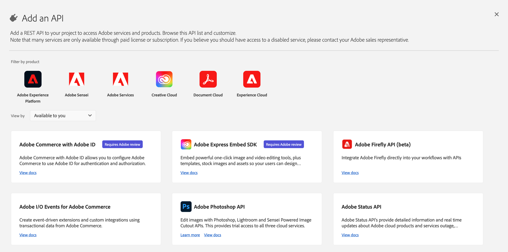
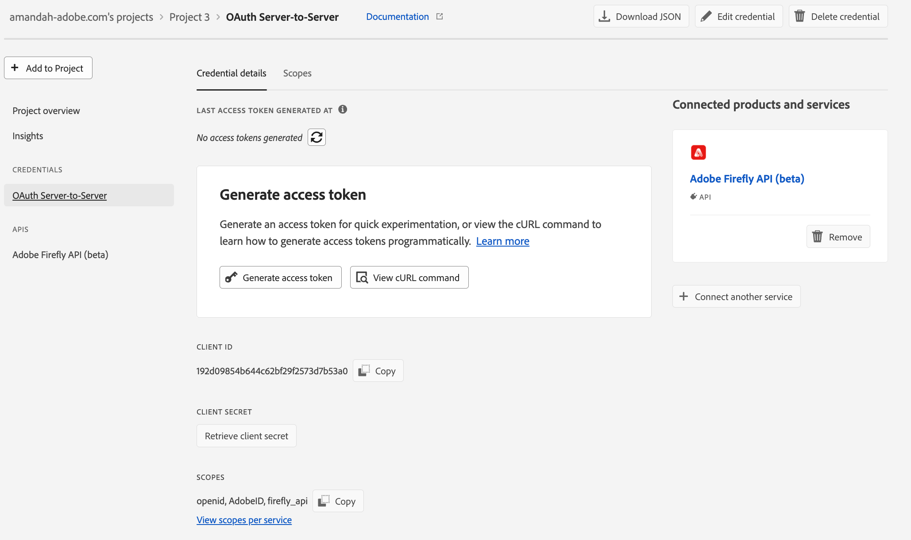

# [Admins only] Get Credentials

<InlineAlert variant="warning" slots="text" />

This page contains instructions for these admins to create project keys for their teams. If you are a developer and your admin has shared a valid key with you, head over to the [quickstart guide](../index.md)

## Join pre-release program

You should have received a separate link to join the Adobe Firefly API (Beta) pre-release program. Once you accept the invitation and joins the pre-release program, you can now access the Firefly API in [Adobe Developer Console](https://developer.adobe.com/console). Only admins (authorized users) can create new Firefly integrations on behalf of your organization.

## Access Adobe Developer Console

:::attention NOTE FOR ORGANIZATION ADMINS
Log into Adobe Developer Console with the same account and profile you used to accept the pre-release program invite.
:::

Navigate to the __API and services__ section. Search for __Adobe Firefly API (beta)__.



Can't find the Adobe Firefly API (beta)? No worries, give it a few minutes and try again. Reach out to your Adobe liaison if you cannot see the Firefly API product card.

## Create a new project

Once you can see the Firefly API product card, click the __Create project__ button.

1. Let's start by registering your project name. This will help you find your project in the Developer Console later. You will be able to modify this name later.
2. Click on __Save configured API__ in the following modal. On the next screen, you will be able to see your __client ID__ (API key).
3. From the left navigation, select __OAuth Server-to-Server__ and you can click __Retrieve client secret__ to get your client secret.



__To make calls to the Firefly API, developer(s) need a valid client ID (API key) and an access token__. Since organization admins are the only ones who can access these projects in the Console, using the __Generate access token__ button on the credential overview page is not ideal.

:::attention Note for organization admins
Instead of sharing access tokens, we recommend sharing the __client ID__ and __client secret__ with developers who need access to the API. This way, they can programmatically generate new access tokens as each access token expires after 24 hours.
:::

After you have successfully configured your project in Developer Console:

- In the __Generate access tokens__ block, select __View cURL command__.
- Copy the command and share with developers in your org. It should look similar to the following:

```bash
curl -X POST 'https://ims-na1.adobelogin.com/ims/token/v3' \
-H 'Content-Type: application/x-www-form-urlencoded' \
-d 'grant_type=client_credentials&client_id={client_id}&client_secret={client_secret}&scope=openid,AdobeID,firefly_enterprise,firefly_api'
```

Read more about generating access tokens in the [authentication guide](../authentication/index.md). There, you can also find the steps for rotating your client secret programmatically.
