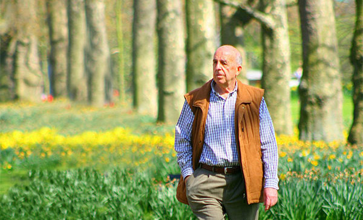
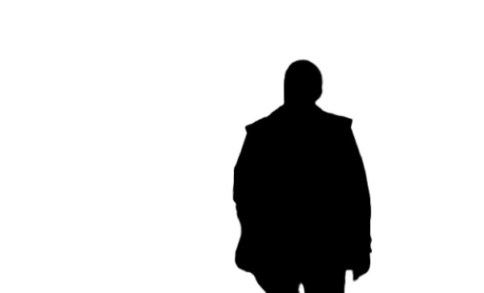
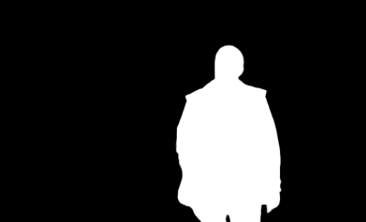

# Masking 

Use masks to control image maniplation in Firefly APIs

||
| --- | --- |
|  | 

## Overview

Masking is a powerful concept in image editing that allows you to isolate specific parts of an image for modifications while leaving other areas unchanged. This process is essential in scenarios where you want precise control over which portions of an image are edited.

In the case of Firefly APIs, masking can help with many operations such as Fill Image and Generate Object Composite endpoints to tell firefly which areas of an image can be modified/filled. 

## Mask

A mask is a grayscale overlay applied to an image. It determines which parts of the image are protected (unaffected by edits) and which parts are exposed (open to edits). Here's how it works:

* **Black Areas:** These are **protected**. No changes or edits will apply to these regions.
* **White Areas**: These are **exposed**. Edits or changes will apply only to these regions.

**Example:**

**Original Image** - A person walking in a park

**Mask** - The white area isolates the background, indicating that only this part of the image can be edited. The white background exposes the park scenery to any changes.

Think of the white areas as beams from a flashlight illuminating the parts of the image where edits can occur, while the black areas stay in shadow, shielded from any alterations.

## Inverted Mask

An inverted mask flips the roles of the black and white areas in the original mask:

* Previously Black Areas become **exposed** for editing.
* Previously White Areas become **protected**.

**Example:**

**Mask** - The white area isolates the background, indicating that only this part of the image can be edited. The white background exposes the park scenery to any changes.

**Mask** - The white area isolates the person, indicating that only this part of the image can be edited. The black background protects the park scenery from any changes.

Inverting a mask is a quick way to reverse the selection of editable areas without creating a new mask. This technique offers flexibility, allowing you to focus on different parts of the image as needed during the editing process.