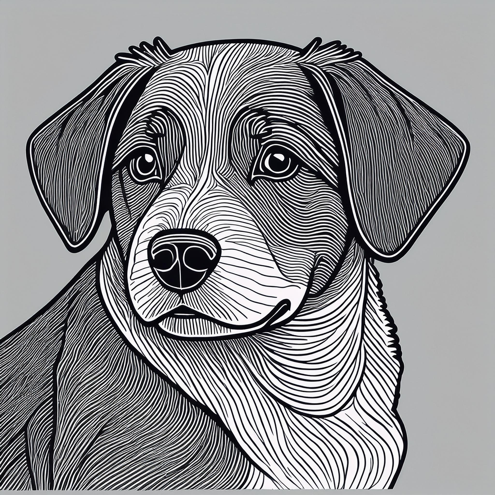

# Style Reference Images

Use Style References images to generate variations based on specific styles, colors, artistic methods, or mood.

||
| --- | --- |
|  <p style="text-align:center">Style Reference Image</p> |  <p style="text-align:center">Generated Image</p>

## Using a Style Reference

Use an existing image as a Style Reference to guide the look and feel of generated image variations. Style reference can help develop a consistent look across a variety of generated assets.

This feature, along with a [Structure Reference](../structure-image-reference/index.md), gives you more control of image generation beyond the text prompt.

### Specifying strength

To influence how strong your reference image's effect is during the image generation process, add a `strength` value between `1` and `100` to your style object. When strength isn't specified, it defaults to a value of `50`.

## Concepts in action

<InlineAlert variant="warning" slots="header, text" />

Before you start

You'll need a Firefly **Client ID** and **Access Token** for this exercise. Learn how to retrieve them in the [Authentication Guide[1]. **Securely store these credentials and never expose them in client-side or public code.**

1. Open a secure terminal and `export` your **Client ID** and **Access Token** as environment variables:

```bash
export FIREFLY_SERVICES_CLIENT_ID=<your_client_id>
export FIREFLY_SERVICES_ACCESS_TOKEN=<your_access_token>
```

Next, save the image of the mountain to your computer's Desktop.

Next, upload your saved image to Firefly's storage API:

```bash
curl --location 'https://firefly-api.adobe.io/v2/storage/image' --header 'Content-Type: image/webp' --header 'Accept: application/json' --header "x-api-key: $FIREFLY_SERVICES_CLIENT_ID" --header "Authorization: Bearer $FIREFLY_SERVICES_ACCESS_TOKEN" --data-binary '@/Users/<YOUR_MACHINE_USERNAME>/Desktop/style-image-reference-mountain.webp'
```

You'll receive a response that looks like this:

```json
{"images":[{"id":"0eb8584a-b850-4c4c-a234-185d6378ecb6"}]}
```

Export it so that the next script can easily access it:

```bash
export FIREFLY_UPLOAD_ID=<your_upload_id>
```

Finally, generate a new image based on the uploaded image:

```bash
curl --location 'https://firefly-api.adobe.io/v3/images/generate' \
--header 'Content-Type: application/json' \
--header 'Accept: application/json' \
--header "x-api-key: $FIREFLY_SERVICES_CLIENT_ID" \
--header "Authorization: Bearer $FIREFLY_SERVICES_ACCESS_TOKEN" \
--data '{
  "numVariations": 4,
  "prompt": "a friendly dog",
  "style": {
    "imageReference": {
      "source": {
        "uploadId": "'$FIREFLY_UPLOAD_ID'"
      }
    }
  }
}'
```

<!-- Links -->
[1]: ../authentication/index.md
