# Style Presets

Use style presets to customize the look and feel of your generated images.

## Understanding style presets

Firefly offers a collection of style presets to use with the [Generate Images API][1] that can give generated images a specific visual style or mood. By indicating these presets in the API request, you have more control, beyond the prompt, to create image variations.

Style presets are defined in the `presets` array in the Generate Images API request. All presets in the array apply to the generated image. To influence the impact of the presets, add or adjust the `strength` value.

<CodeBlock slots="heading, code" languages="JSON" />

Request parameter for presets

```json
// ... API request cURL ...
--data '{
    "prompt": "a puppy dressed as a renaissance artist",
    "numVariations": 4,
    "style": {
        // array of style presets for image variations
        "presets": [   
            "bw", "fantasy", "dramatic_light"
        ],
        "strength": 100
    }
}'
```

## Style Presets examples

Here are the style presets available and examples of the images they generate. Use these presets, in snake_case, in the API request.

||
| --- | --- | --- |
| 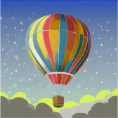 <p style="text-align:center">graphic</p> | 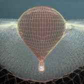 <p style="text-align:center">wireframe</p> | 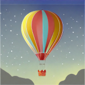 <p style="text-align:center">vector_look</p>
|  <p style="text-align:center">bw</p> | 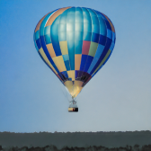 <p style="text-align:center">cool_colors</p> | 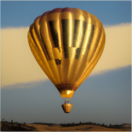 <p style="text-align:center">golden</p>
| 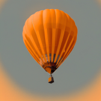 <p style="text-align:center">monochromatic</p> |  <p style="text-align:center">muted_color</p> | 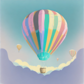 <p style="text-align:center">pastel_color</p>
|  <p style="text-align:center">toned_image</p> |  <p style="text-align:center">vibrant_colors</p> |  <p style="text-align:center">warm_tone</p>
|  <p style="text-align:center">closeup</p> | 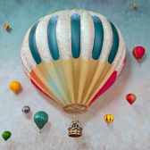 <p style="text-align:center">knolling</p> |  <p style="text-align:center">landscape_photography</p>
| 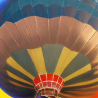 <p style="text-align:center">macrophotography</p> | 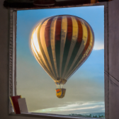 <p style="text-align:center">photographed_through_window</p> |  <p style="text-align:center">shallow_depth_of_field</p>
|  <p style="text-align:center">shot_from_above</p> |  <p style="text-align:center">shot_from_below</p> | 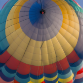 <p style="text-align:center">surface_detail</p>
|  <p style="text-align:center">wide_angle</p> | 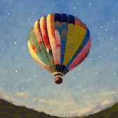 <p style="text-align:center">beautiful</p> | 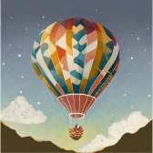 <p style="text-align:center">bohemian</p>
| 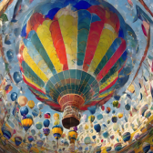 <p style="text-align:center">chaotic</p> | 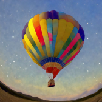 <p style="text-align:center">dais</p> |  <p style="text-align:center">divine</p>
| 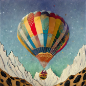 <p style="text-align:center">eclectic</p> | 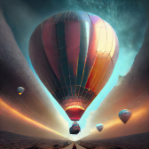 <p style="text-align:center">futuristic</p> | 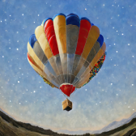 <p style="text-align:center">kitschy</p>
|  <p style="text-align:center">nostalgic</p> | 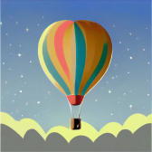 <p style="text-align:center">simple</p> | 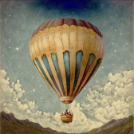 <p style="text-align:center">antique_photo</p>
| 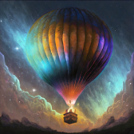 <p style="text-align:center">bioluminescent</p> |  <p style="text-align:center">bokeh</p> | 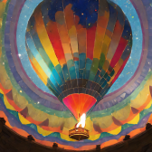 <p style="text-align:center">color_explosion</p>
| 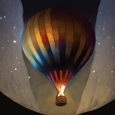 <p style="text-align:center">dark</p> | 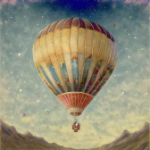 <p style="text-align:center">faded_image</p> | 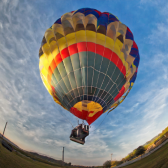 <p style="text-align:center">fisheye</p>
| 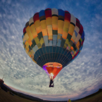 <p style="text-align:center">gomori_photography</p> |  <p style="text-align:center">grainy_film</p> | 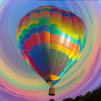 <p style="text-align:center">iridescent</p>
| 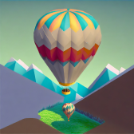 <p style="text-align:center">isometric</p> | 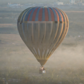 <p style="text-align:center">misty</p> | 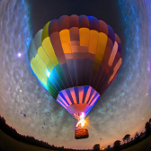 <p style="text-align:center">neon</p>
| 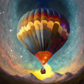 <p style="text-align:center">otherworldly_depiction</p> | 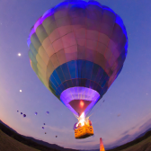 <p style="text-align:center">ultraviolet</p> | 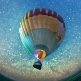 <p style="text-align:center">underwater</p>
|  <p style="text-align:center">backlighting</p> |  <p style="text-align:center">dramatic_light</p> |  <p style="text-align:center">golden_hour</p>
|  <p style="text-align:center">harsh_light</p> |  <p style="text-align:center">long</p> | 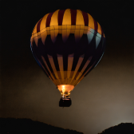 <p style="text-align:center">low_lighting</p>
|  <p style="text-align:center">multiexposure</p> | 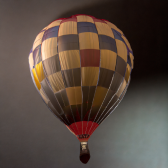 <p style="text-align:center">studio_light</p> |  <p style="text-align:center">surreal_lighting</p>
| 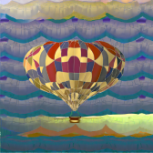 <p style="text-align:center">3d_patterns</p> | 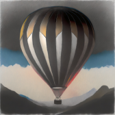 <p style="text-align:center">charcoal</p> |  <p style="text-align:center">claymation</p>
| 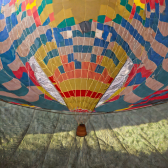 <p style="text-align:center">fabric</p> |  <p style="text-align:center">fur</p> | 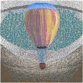 <p style="text-align:center">guilloche_patterns</p>
| 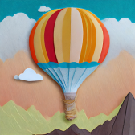 <p style="text-align:center">layered_paper</p> | 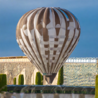 <p style="text-align:center">marble_sculpture</p> | 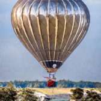 <p style="text-align:center">made_of_metal</p>
| 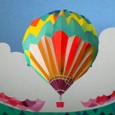 <p style="text-align:center">origami</p> | 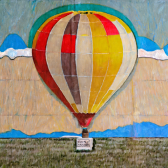 <p style="text-align:center">paper_mache</p> | 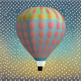 <p style="text-align:center">polka</p>
| 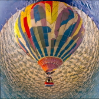 <p style="text-align:center">strange_patterns</p> | 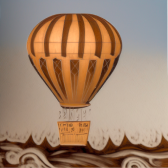 <p style="text-align:center">wood_carving</p> | 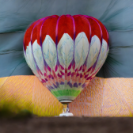 <p style="text-align:center">yarn</p>
| 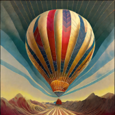 <p style="text-align:center">art_deco</p> | 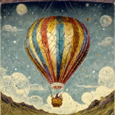 <p style="text-align:center">art_nouveau</p> |  <p style="text-align:center">baroque</p>
|  <p style="text-align:center">bauhaus</p> |  <p style="text-align:center">constructivism</p> |  <p style="text-align:center">cubism</p>
|  <p style="text-align:center">cyberpunk</p> |  <p style="text-align:center">fantasy</p> |  <p style="text-align:center">fauvism</p>
|  <p style="text-align:center">film_noir</p> |  <p style="text-align:center">glitch_art</p> |  <p style="text-align:center">impressionism</p>
|  <p style="text-align:center">industrialism</p> |  <p style="text-align:center">maximalism</p> |  <p style="text-align:center">minimalism</p>
|  <p style="text-align:center">modern_art</p> |  <p style="text-align:center">modernism</p> |  <p style="text-align:center">neo</p>
|  <p style="text-align:center">pointillism</p> |  <p style="text-align:center">psychedelic</p> |  <p style="text-align:center">science_fiction</p>
|  <p style="text-align:center">steampunk</p> |  <p style="text-align:center">surrealism</p> |  <p style="text-align:center">synthetism</p>
|  <p style="text-align:center">synthwave</p> |  <p style="text-align:center">vaporwave</p> |  <p style="text-align:center">acrylic_paint</p>
|  <p style="text-align:center">bold_lines</p> |  <p style="text-align:center">chiaroscuro</p> |  <p style="text-align:center">color_shift_art</p>
|  <p style="text-align:center">daguerreotype</p> |  <p style="text-align:center">digital_fractal</p> |  <p style="text-align:center">doodle_drawing</p>
|  <p style="text-align:center">double_exposure_portrait</p> |  <p style="text-align:center">fresco</p> |  <p style="text-align:center">geometric_pen</p>
|  <p style="text-align:center">halftone</p> |  <p style="text-align:center">ink</p> |  <p style="text-align:center">light_painting</p>
|  <p style="text-align:center">line_drawing</p> |  <p style="text-align:center">linocut</p> |  <p style="text-align:center">oil_paint</p>
|  <p style="text-align:center">paint_spattering</p> |  <p style="text-align:center">painting</p> |  <p style="text-align:center">palette_knife</p>
|  <p style="text-align:center">photo_manipulation</p> |  <p style="text-align:center">scribble_texture</p> | <p style="text-align:center">sketch</p>
|  <p style="text-align:center">splattering</p> |  <p style="text-align:center">stippling_drawing</p> |  <p style="text-align:center">watercolor</p>
|  <p style="text-align:center">3d</p> |  <p style="text-align:center">anime</p> |  <p style="text-align:center">cartoon</p>
|  <p style="text-align:center">cinematic</p> |  <p style="text-align:center">comic_book</p> |  <p style="text-align:center">concept_art</p>
|  <p style="text-align:center">cyber_matrix</p> |  <p style="text-align:center">digital_art</p> |  <p style="text-align:center">flat_design</p>
|  <p style="text-align:center">geometric</p> |  <p style="text-align:center">glassmorphism</p> |  <p style="text-align:center">glitch_graphic</p>
|  <p style="text-align:center">graffiti</p> |  <p style="text-align:center">hyper_realistic</p> |  <p style="text-align:center">interior_design</p>
|  <p style="text-align:center">line_gradient</p> |  <p style="text-align:center">low_poly</p> |  <p style="text-align:center">newspaper_collage</p>
|  <p style="text-align:center">optical_illusion</p> |  <p style="text-align:center">pattern_pixel</p> |  <p style="text-align:center">pixel_art</p>
|  <p style="text-align:center">pop_art</p> |  <p style="text-align:center">product_photo</p> |  <p style="text-align:center">psychedelic_background</p>
|  <p style="text-align:center">psychedelic_wonderland</p> |  <p style="text-align:center">scandinavian</p> |  <p style="text-align:center">splash_images</p>
|  <p style="text-align:center">stamp</p> |  <p style="text-align:center">trompe_loeil</p>

## Concepts in action

Let's use style presets to generate a few image variations.

<InlineAlert variant="warning" slots="header, text" />

Before you start

You'll need a Firefly **Client ID** and **Access Token** for this exercise. Learn how to retrieve them in the [Authentication Guide][2]. **Securely store these credentials and never expose them in client-side or public code.**

1. First, open a secure terminal and `export` your **Client ID** and **Access Token** as environment variables:

```bash
export FIREFLY_SERVICES_CLIENT_ID=<your_Client_ID>
export FIREFLY_SERVICES_ACCESS_TOKEN=<your_Access_Token>
```

2. Next, make the request to the Generate Images API. We'll use a prompt for a Shakespearean puppy, and enter a few presets so that they apply together:

```bash
curl --location 'https://firefly-api.adobe.io/v3/images/generate-async' \
--header 'Content-Type: application/json' \
--header 'Accept: application/json' \
--header "x-api-key: $FIREFLY_SERVICES_CLIENT_ID" \
--header "Authorization: Bearer $FIREFLY_SERVICES_ACCESS_TOKEN" \
--data '{
    "prompt": "a puppy dressed as a renaissance artist",
    "numVariations": 4,
    "style": {
        "presets": [
            "bw", "fantasy", "dramatic_light"
        ]
    }
}'
```

The request returns a rapid response for the asynchronous job:

```json
{   
    "jobId":"<YOUR_JOB_ID>",
    "statusUrl":"https://firefly-epo854211.adobe.io/v3/status/urn:ff:jobs:...",
    "cancelUrl":"https://firefly-epo854211.adobe.io/v3/cancel/urn:ff:jobs:..."
}
```

3. Use the `jobId` to see the result:

<InlineAlert variant="info" slots="header, text" />

NOTE

The `numVariations` value creates four generated images that will be easy to compare. Four URLs are returned in the response.

```bash
curl -X GET "https://firefly-api.adobe.io/v3/status/<YOUR_JOB_ID>" \
    -H "x-api-key: $FIREFLY_SERVICES_CLIENT_ID" \
    -H "Authorization: Bearer $FIREFLY_SERVICES_ACCESS_TOKEN" \
    -H "Content-Type: application/json"
```

You'll see results similar to our example below. Notice that all the defined presets were applied to the prompt for a renaissance puppy!

**Sample Result**

![A renaissance artist puppy generated with presets][3]

<!-- links -->
[1]: ../../api/image_generation/V3_Async/
[2]: ../authentication/index.md
[3]: ../../images/puppy-renaissance-artist.jpeg
