# Image Model Styles

Certain Firefly API endpoints, including the [Generate Images](../../api/image_generation/V3/) and [Generate Object Composite](../../api/generate-object-composite/) APIs allow you to specify optional content classes and image styles which influence the generated output.

The table below exemplifies the visual representations of each of the content classes and image styles/presets available. Simply specify the `Preset ID` as a string to the Firefly API call where they are supported. 

<InlineAlert variant="success" slots="text" />

Check out the [Using Content Class and Style Presets](../../how-tos/using-content-class-style-preset.md) guide for more details on using content class and style presets.

||
|:-------------------| :--------:
| photo              |  
photo

| art                | 
| graphic            | 
| bw                 | 
| cool_colors        | 
| golden             | 
| monochromatic      | 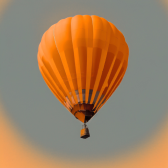
| muted_color        | 
| pastel_color       | 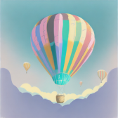
| toned_image        | 
| vibrant_colors     | 
| warm_tone          | 
| closeup            | 
| knolling           | 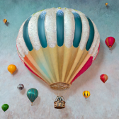
| landscape_photography | 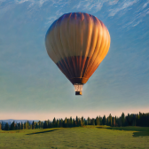
| macrophotography   | 
| photographed_through_window | 
| shallow_depth_of_field | 
| shot_from_above    | 
| shot_from_below    | 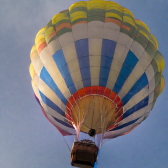
| surface_detail     | 
| wide_angle         | 
| beautiful          | 
| bohemian           | 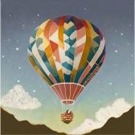
| chaotic            | 
| dais               | 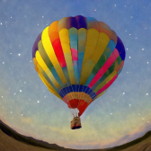
| divine             | 
| eclectic           | 
| futuristic         | 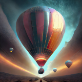
| kitschy            | 
| nostalgic          | 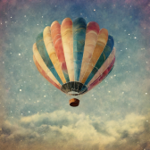
| simple             | 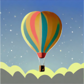
| antique_photo      | 
| bioluminescent     | 
| bokeh              | 
| color_explosion    | 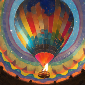
| dark               | 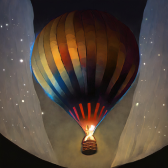
| faded_image        | 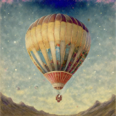
| fisheye            | 
| gomori_photography | 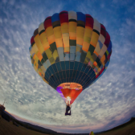
| grainy_film        | 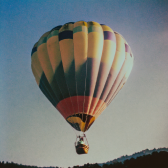
| iridescent         | 
| isometric          | 
| misty              | 
| neon               | 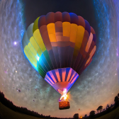
| otherworldly_depiction | 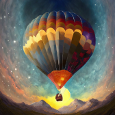
| ultraviolet        | 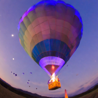
| underwater         | 
| backlighting       | 
| dramatic_light     | 
| golden_hour        | 
| harsh_light        | 
| long-time_exposure | 
| low_lighting       | 
| multiexposure      | 
| studio_light       | 
| surreal_lighting   | 
| 3d_patterns        | 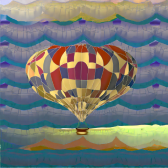
| charcoal           | 
| claymation         | 
| fabric             | 
| fur                | 
| guilloche_patterns | 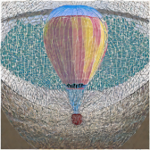
| layered_paper      | 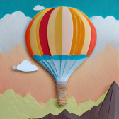
| marble_sculpture   | 
| made_of_metal      | 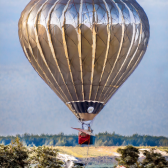
| origami            | 
| paper_mache        | 
| polka-dot_pattern  | 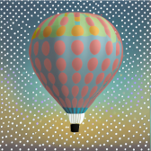
| strange_patterns   | 
| wood_carving       | 
| yarn               | 
| art_deco           | 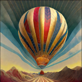
| art_nouveau        | 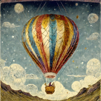
| baroque            | 
| bauhaus            | 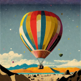
| constructivism     | 
| cubism             | 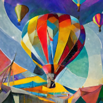
| cyberpunk          | 
| fantasy            | 
| fauvism            | 
| film_noir          | 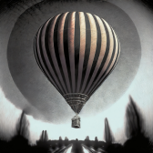
| glitch_art         | 
| impressionism      | 
| industrialism      | 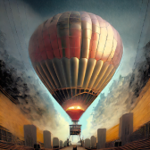
| maximalism         | 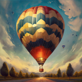
| minimalism         | 
| modern_art         | 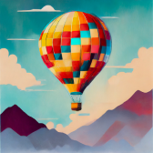
| modernism          | 
| neo-expressionism  | 
| pointillism        | 
| psychedelic        | 
| science_fiction    | 
| steampunk          | 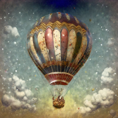
| surrealism         | 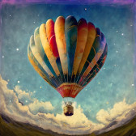
| synthetism         | 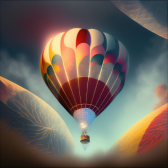
| synthwave          | 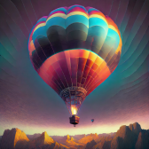
| vaporwave          | 
| acrylic_paint      | 
| bold_lines         | 
| chiaroscuro        | 
| color_shift_art    | 
| daguerreotype      | 
| digital_fractal    | 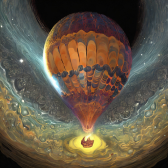
| doodle_drawing     | 
| double_exposure_portrait | 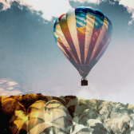
| fresco             | 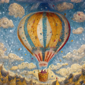
| geometric_pen      | 
| halftone           | 
| ink                | 
| light_painting     | 
| line_drawing       | 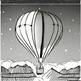
| linocut            | 
| oil_paint          | 
| paint_spattering   | 
| painting           | 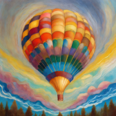
| palette_knife      | 
| photo_manipulation | 
| scribble_texture   | 
| sketch             |
| splattering        | 
| stippling_drawing  | 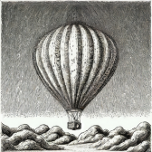
| watercolor         | 
| 3d                 | 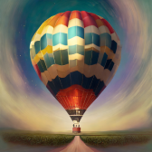
| anime              | 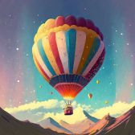
| cartoon            | 
| cinematic          | 
| comic_book         | 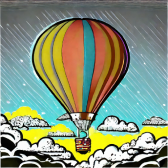
| concept_art        | 
| cyber_matrix       | 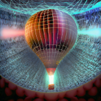
| digital_art        | 
| flat_design        | 
| geometric          | 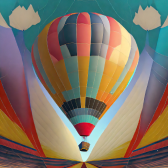
| glassmorphism      | 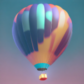
| glitch_graphic     | 
| graffiti           | 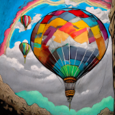
| hyper_realistic    | 
| interior_design    | 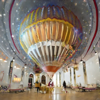
| line_gradient      | 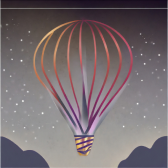
| low_poly           | 
| newspaper_collage  | 
| optical_illusion   | 
| pattern_pixel      | 
| pixel_art          | 
| pop_art            | 
| product_photo      | 
| psychedelic_background | 
| psychedelic_wonderland | 
| scandinavian       | 
| splash_images      | 
| stamp              | 
| trompe_loeil       | 
| vector_look        | 
| wireframe          | 
