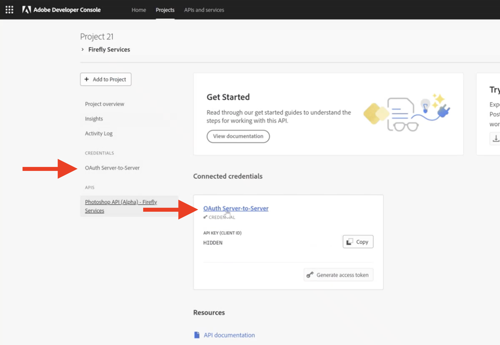
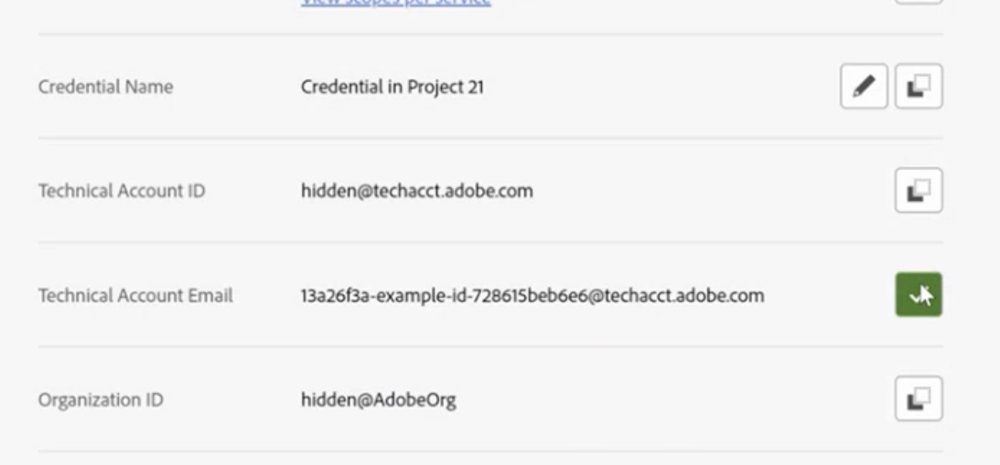
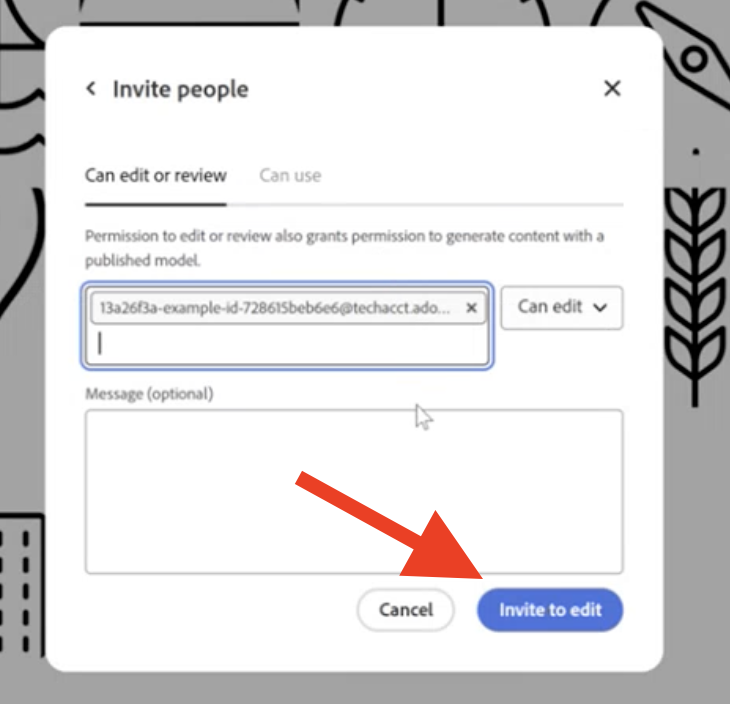

# Grant Applications Access to Your Custom Model Guide

Use this guide to give applications access to your custom models,
making them available for use with API endpoints.

## Overview

Once you've [trained a custom model](../../concepts/custom-models), you need to share it with your technical account
so that the model is accessible to the [List Custom Models](../../api/list_custom_models/) API
and the [Text to Image](../../api/image_generation/V3_Async/) API.

<InlineAlert variant="info" slots="header, text" />

Note

Any models shared at the organization level are also shared with individual projects.

<Media slots="video"/>

[Share a custom model](https://youtu.be/_xxXrEWZ8cc)

## To share the custom model

Follow the steps below:

1. Navigate to your project in the [Adobe Developer Console](https://developer.adobe.com/console/home). Click the API credential link, either in the sidenav or under the credentials header.

<TextBlock slots="image, text" imgWidth="30%" position="center" />

2. Copy the **Technical Account Email**.

3. Log in to your [Firefly account](https://firefly.adobe.com/) and [navigate to the custom model](https://firefly.adobe.com/custom-models) itself.
4. Click the **"..."** button in the top right for more options, then click **Share**.
5. In the modal window, paste the technical account email in the field for *Add people or groups*.

<TextBlock slots="image, text" imgWidth="30%" position="center" />

6. Click **Invite to edit**.

<InlineAlert variant="help" slots="header, text" />

Tip

The account may appear in the *Pending* state for sharing, but access
to the custom model is granted.

Now that you've shared your custom model it will be available through the API endpoint.
