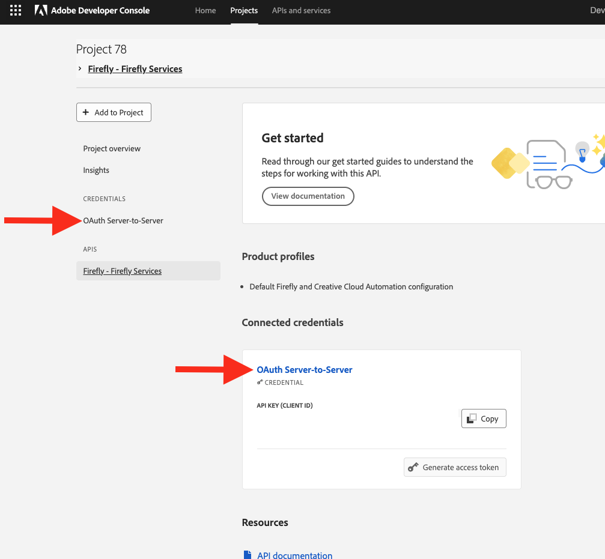

# Share a Custom Model Guide

Use this guide to make a custom model available for use with the [List Custom Models](./api/list_custom_models/) API.

## Overview

Once you've [trained a custom model](../concepts/custom-models), you need to share it with your API key to make that model accessible to the List Custom Models endpoint.

Any models shared at the organization level are also shared with individual projects.

<Media slots="video"/>

[Share a custom model](https://youtu.be/7IQ4G5t6PPc)

## To share the custom model

Follow the steps below:

1. Navigate to your project in the [Adobe Developer Console](https://developer.adobe.com/console/home). Click the API credential link, either in the sidenav or under the credentials header.

<TextBlock slots="image, text" imgWidth="30%" position="center" />

2. Copy the **Technical Account Email**.
3. Navigate to the custom model itself in the [Firefly web UI](https://firefly.adobe.com/custom-models).

4. Click the **"..."** button in the top right for more options, then click **Share**.
5. In the modal window, paste the technical account email in the field for *Add people or groups*.

<TextBlock slots="image, text" imgWidth="30%" position="center" />

6. Click **Invite to edit**.

Now that you've shared your custom model it will be available through the API endpoint.
