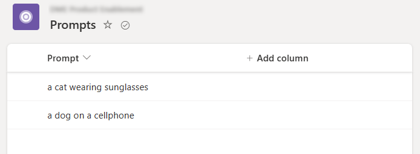
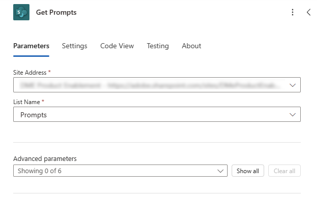
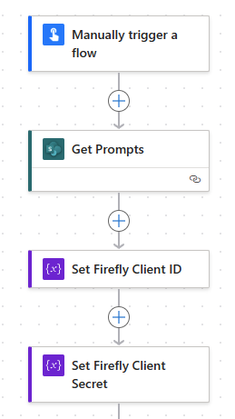
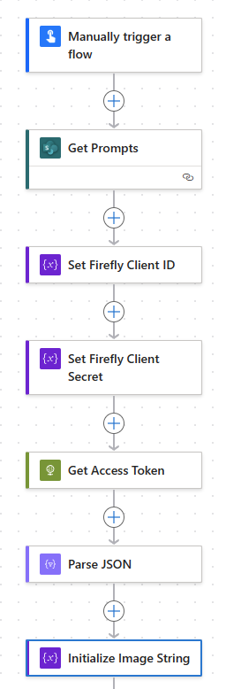
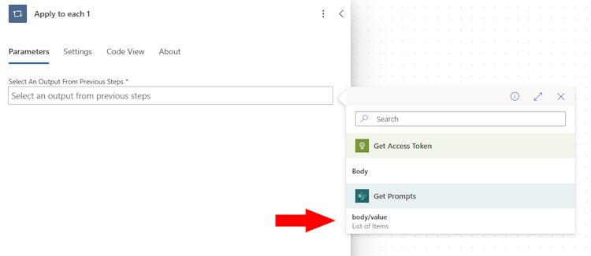
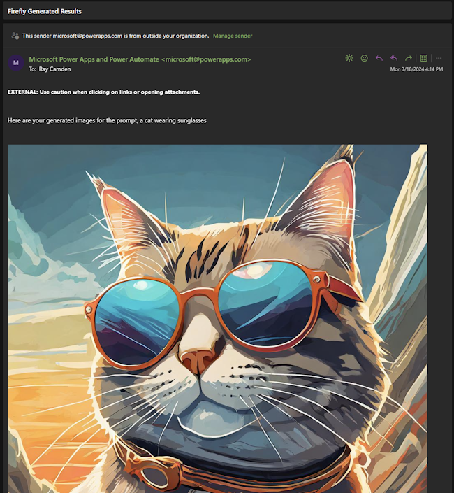

# Integrating Firefly Services with Microsoft Power Automate

Microsoft's [Power Automate](https://make.powerautomate.com) is a powerful no-code solution that lets developers and non-developers alike create flexible workflows to automate processing using multiple different services. Firefly Services can be employed in the Power Automate platform and in this article, we'll walk you through the process of creating a sample workflow. Keep in mind that Power Automate is incredibly flexible and the example shown here is just one possible use of the platform.

## Prerequisites

To complete this tutorial, you will need:

* Firefly API credentials. If you don't have them yet, first visit the Firefly Services [Getting Started](../../../guides/get-started.md) guide to obtain a `client_id` and `client_secret`.
* An account with Microsoft and access to Power Automate. 

## Workflow

Our workflow will use the Firefly API to generate images. The steps involved are:

- Reading a set of prompts from a Microsoft list.
- Sending each prompt to Firefly.
- Take the result and send an email.

For simplicity's sake, this flow will be manually triggered, but certainly, but you could create a dynamically triggered workflow.

## Step 1: Defining our prompts

As described earlier, we will use Microsoft List to define our prompts. We created a new list, named it _Prompts_, and added two simple values in the first column.



## Step 2: Create the flow

Next, create a new _Instant_ Power Automate flow. This will let us test as needed without being tied to any automatic process. Everything demonstrated in this article absolutely *could* run in that scenario. 

## Step 3: Read our list

PowerAutomate has steps that automatically integrate with Lists, so the next step will be to add the "Get items" action from Sharepoint. This will require you to configure the Sharepoint site hosting and select the list. 



Note that we've renamed the action to _Get Prompts_.

## Step 4: Define Variables

The following two actions are optional but help us out later in the flow. Create two actions to initialize variables. We're going to create two string values to store our Firefly authentication. The first one should use these values:

* Name: `FIREFLY_CLIENT_ID`
* Type: `String`
* Value: `Your client id`

Name this step, _Set Firefly Client ID_.

The next one will use these values:

* Name: `FIREFLY_CLIENT_SECRET`
* Type: `String`
* Value: `Your client secret`

Name this step, _Set Firefly Client Secret_.

At this point, your flow should look like this:



## Step 6: Exchange Credentials

The next step will use the HTTP action to exchange our credentials for an access token. Add a new step, HTTP, and use the following URI:

```bash
https://ims-na1.adobelogin.com/ims/token/v3?grant_type=client_credentials&client_id=@{variables('FIREFLY_CLIENT_ID')}&client_secret=@{variables('FIREFLY_CLIENT_SECRET')}&scope=openid,AdobeID,session,additional_info,read_organizations,firefly_api,ff_apis
```

<InlineAlert slots="text" />

As soon as you enter that value, the two `variables` section will change to reference the two earlier steps we defined. Set the method to POST and name the action, _Get Access Token_.

Follow this with a _Parse JSON_ step. The content value will point to the body of the previous step. The schema will be the following:

```json
{
    "type": "object",
    "properties": {
        "access_token": {
            "type": "string"
        },
        "token_type": {
            "type": "string"
        },
        "expires_in": {
            "type": "integer"
        }
    }
}
```

This was created by using the "Use sample payload to generate schema" support in the step and by passing in a previous authentication result. 

The net result of these two steps is to get an access token for Firefly calls and parse the result so Power Automate can make use of it. 

## Step 6: Initialize Image String

Before we start using the API, we need to define a variable, _images_, that we'll use for our results. Add a new step to initialize a variable with these values:

* name: `images`
* type: `String`
* value: `Leave blank`

Name this step, "Initialize Image String".

At this point, your flow should look like this:



## Step 7: Beginning the Loop

OOur workflow will generate results for each prompt and email them, so now we add a new action, _Apply to each_ (found in the _Control_ section when adding a new action). You will be prompted to select an output to drive the looping. If you remember, we read in our Microsoft List value in the beginning, so choose that:



All of the next steps will be defined inside this loop. 

## Step 8: Resetting the Images Variable

In step six, we created an image variable named `images`. The point of this variable is to hold the results from Firefly so that it can be emailed. We need to reset this value for each prompt to an empty string. So, the first step inside our _Apply to each_ loop is a _Set the variable value_ action. It sets the variable, `images`, to null. 

You can do this by entering: `@{null}`

## Step 9: Calling Firefly's Text-to-Image API

We'll add another HTTP action that will call the [Text-to-Image](../api/image_generation/) API. This API call requires a few parameters, including the prompt and number of desired images if you want more than one. 

Begin by setting the URI to the API endpoint, as specified in the documentation: `https://firefly-api.adobe.io/v2/images/generate`. 

Next, set the method to `POST`. 

To access the API, two credentials must be sent in the headers. Begin by specifying an `Authorization` header which will use the access token gotten earlier. This can be used by inputting this value: `Bearer @{body('Parse_JSON')?['access_token']}`. Next, the header `X-Api-Key` should be set with the Firefly Client ID specified earlier: `@{variables('FIREFLY_CLIENT_ID')}`

The last thing required is the actual body of the request. The number of images and size will be hard coded, with the prompt being dynamic based on the loop value:

```json
{
  "n": 4,
  "prompt": "@{items('Apply_to_each')?['Title']}",
  "size": {
    "width": "1024",
    "height": "1024"
  }
}
```

You should follow this step with a Parse JSON action again. Add that step and name it _Parse Firefly Result JSON_. Point it to the body of the previous step and use this schema:

```json
{
    "type": "object",
    "properties": {
        "version": {
            "type": "string"
        },
        "size": {
            "type": "object",
            "properties": {
                "width": {
                    "type": "integer"
                },
                "height": {
                    "type": "integer"
                }
            }
        },
        "predictedContentClass": {
            "type": "string"
        },
        "outputs": {
            "type": "array",
            "items": {
                "type": "object",
                "properties": {
                    "seed": {
                        "type": "integer"
                    },
                    "image": {
                        "type": "object",
                        "properties": {
                            "id": {
                                "type": "string"
                            },
                            "presignedUrl": {
                                "type": "string"
                            }
                        }
                    }
                },
                "required": [
                    "seed",
                    "image"
                ]
            }
        }
    }
}
```

As before, the net result of these two steps is to make an HTTP call and parse the result into usable data. 

## Step 10: Defining Image HTML

The next step will be twofold. We want to create a string variable for email that will include all the results from the Firefly call, but we want to define this in HTML. To do this, create another "Apply to each" step. This will use the output from the previous step that parsed the JSON result of the Firefly call: `@{body('Parse_Firefly_Result_JSON')?['outputs']}` Notice we're explicitly using the `outputs` portion of the result which will contain one object per image result. 

Within this loop, add an _Append to String variable_ step. The variable will be `images`, and the value, this little bit of complex logic: 

```
@{concat('')}
```

This value uses the `contact` function to join three strings:

* First, the beginning of an HTML image tag.
* Then, the current image from the `outputs` loop, specifying the `presignedUrl` value.
* A closing bracket.

## Step 11: Email the Result

The final step will handle emailing the result. You want to ensure it's in the loop for our prompts but *not* the previous loop that iterated over the image results. 

For the `To` field, specify your email and pick anything appropriate for the `Subject`. 

The body should contain the prompt and our `images` variable:

```
Here are your generated images for the prompt, @{items('Apply_to_each')?['Title']}

@{variables('images')}
```

## Results

With the flow complete, we can save and test it. As it processes, it will fire off one email as each prompt is done. The images are somewhat large, so the screenshot below only shows one, but the additional results are directly beneath it:


