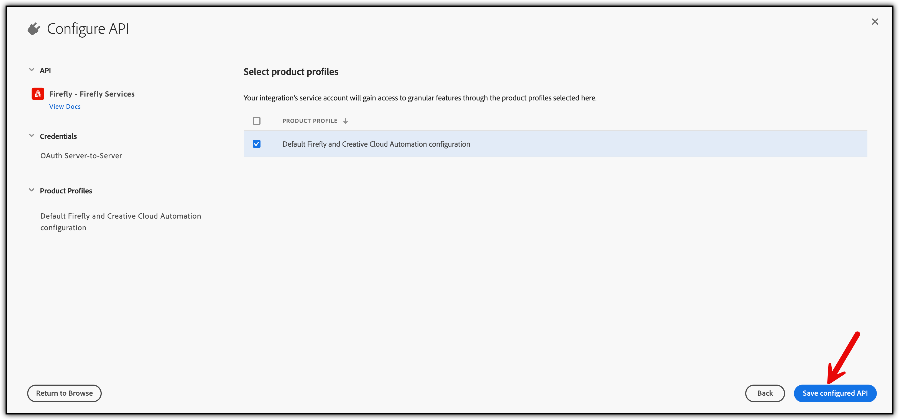
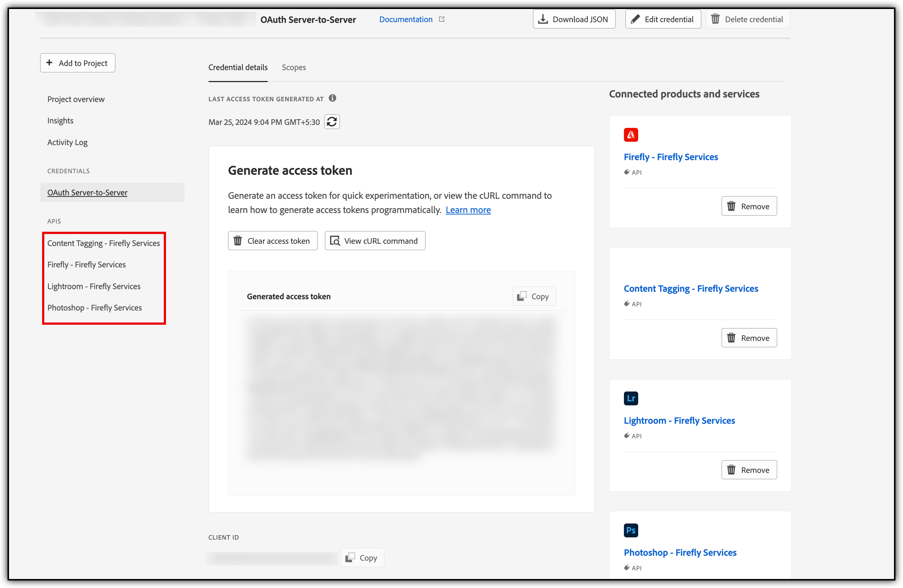

# Getting started with Firefly Services

The first step in accessing the Firefly Services API is getting authenticated. For that, you will need an Authorization Token and an API Key. The steps below will show you how to generate an access token and make your first API call. 

## Overview

Here are the steps to get started with the Firefly services APIs. If you have already got your API key, you can skip these steps and proceed to [Generate access Token](./get-started.md#step-5-generate-access-token) and [make your first API call](./get-started.md#make-your-first-api-call) with Firefly Services.

## Generate an API Key and access token

If you have already been provisioned with access through your organization, you will need to create a project in developer console.

### Step 1: Create a project

1. Go to [https://developer.adobe.com/console/home](https://developer.adobe.com/console/home) and sign in to the Developer Console.
2. Select **Create new project** under the **Quick start** section on the middle of your screen:


### Step 2: Add API to your project

1. Choose **Add API**.

2. Select one of the required APIs, say, **Firefly- Firefly and Creative Cloud Automation** and click **Next**:


### Step 3: Set Credentials
 
* Default choice for type of authentication is made for **OAuth Server-to-Server** and you should keep it.
* Give your credential a name.
* Click **Next**.


### Step 4: Select Product Profiles

Depending on the API you add, you may be asked to select product profiles to assign to your credential. These product profiles govern what data your application can/cannot access in your organization.

Select the **Product Profiles** and click **Save Configured API**. 



Click **Add to Project** to add more APIs to the product profile in the same project. Click **Edit product profiles** to add APIs to a different product profile in the same project. 


Repeat [Step 2](.//get-started.md#step-2-add-api-to-your-project) until you have added all these APIs:

 * Firefly – Firefly and Creative Cloud Automation
 * Lightroom - Firefly and Creative Cloud Automation
 * Photoshop - Firefly and Creative Cloud Automation
 * Content Tagging - Firefly and Creative Cloud Automation

### Step 5: Generate access token

You can click **Generate an access token** for quick experimentation or click view the cURL command to learn how to generate access tokens programmatically. [Learn more](https://developer.adobe.com/developer-console/docs/guides/authentication/ServerToServerAuthentication/implementation/) about how to do it. 

#### Scopes

Scopes that are added for your application define what actions or data the clients are allowed to access. Security best practices recommend that your application generates an access token with the least number of scopes it needs to work correctly. 

Click **View scopes per service** to understand the services and scopes associated with it. 


Sample cURL command:

``` bash
curl -X POST 'https://ims-na1.adobelogin.com/ims/token/v3' \
-H 'Content-Type: application/x-www-form-urlencoded' \
-d 'grant_type=client_credentials&client_id=<YOUR_CLIENT_ID>&scope=openid,AdobeID,read_organizations,firefly_api,ff_apis'
```

The selected APIs will be listed in the left-hand side under **APIS**. 

Grab your **API KEY (Client ID)** from the same screen. 



Congratulations! You have just generated an access token.

## Make your first API call

Once you have created your token, you can follow the steps below to make your first API call.

1.	Open your terminal and paste the code below.
2.	Replace the variables <YOUR_ACCESS_TOKEN> with the token you generated on Adobe I/O Console.
3.	Replace <YOUR_CLIENT_ID>. You can find this on the same page you generated your token on.
4.	Once all variables have been replaced you can run the command.

```bash
curl -X POST \
  https://firefly-api.adobe.io/v2/images/generate \
  -H 'x-api-key: <YOUR_CLIENT_ID> \
  -H 'Authorization: <YOUR_ACCESS_TOKEN> \
  -H 'Content-Type: application/json' \
  -d '{
    "parameter1": "value1",
    "parameter2": "value2"
}'
```

Congratulations! You just made your first request to the Firefly services API.

<<InlineAlert slots="text" />

Note that your token will expire every 24 hours and will need to be refreshed after it expires.

## Start building your applications

You have now Access Token and Client Id. 

You can use it to build your application using Firefly services APIs.

## Explore more

<DiscoverBlock slots="link, text"/>

[SDK](guides/sdks/)

Explore our unified client SDKs. 

<DiscoverBlock slots="link, text"/>

[Photoshop API](https://developer.adobe.com/photoshop/photoshop-api-docs/api/)

Unlock the potential of Photoshop API.

<DiscoverBlock slots="link, text"/>

[Lightroom API](https://developer.adobe.com/photoshop/photoshop-api-docs/api/#tag/Lightroom)

Unlock the potential of Lightroom API.

<DiscoverBlock slots="link, text"/>

[Firefly API](https://developer.adobe.com/firefly-api/)

Integrate generative AI into your creative workflows.

<DiscoverBlock slots="link, text"/>

[Content Tagging](https://experienceleague.adobe.com/en/docs/experience-platform/intelligent-services/content-commerce-ai/overview)

Extract intelligent features from your content, organize and streamline content flow, and deliver more impactful, personalized customer experiences.