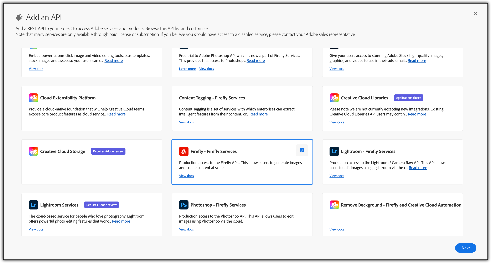
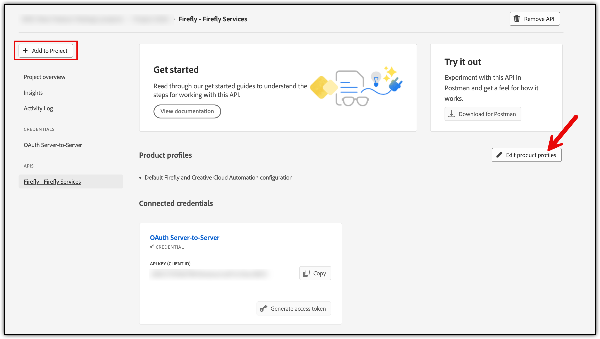

# Getting started with Adobe Firefly Services

The first step in accessing the Firefly Services API is getting authenticated. For that, you will need an access token and an API Key. The steps below will show you how to generate an access token and make your first API call.

## Overview

Here are the steps to get started with the Firefly Services APIs. If you have already received your credentials, jump straight to our [Firefly API Quickstart guide](../firefly-api/guides/index.md) to begin interacting with Firefly Services.

## Gaining access to the Adobe Developer Console

Enterprise customers must be assigned the _System Administrator_ or _Developer_ role in the Adobe Admin Console to access the Adobe Developer Console.

* Identify an Adobe Admin in your Enterprise. This may be as simple as checking the notes in your Adobe account. Adobe's Solution Consultants will also typically have an administrator contact for the organization.
* Have the Admin set up either _System Administrator_ or _Developer_ roles for users who will need to generate API keys. Alternatively, ask your Admin to generate the keys if they feel elevating roles is too risky. If your Admin does this for you, skip to the [Make your first API Call](get-started.md#make-your-first-api-call) section.
* If your Admin allows you to generate your API keys, the Admin will also need to assign Firefly - Firefly Services to you as a product in the Admin Console.

## Generate an API Key and access token from the Adobe Developer Console

If you have already been provisioned with access through your organization, you will need to create a project in developer console.

### Step 1: Create a project

1. Go to [https://developer.adobe.com/console/home](https://developer.adobe.com/console/home) and sign in to the Developer Console.
2. Select **Create new project** under the **Quick start** section on the middle of your screen:


### Step 2: Add API to your project

1. Choose **Add API**.

2. Select one of the required APIs, say, **Firefly - Firefly Services** and click **Next**:


### Step 3: Set Credentials

* Default choice for type of authentication is made for **OAuth Server-to-Server** and you should keep it.
* Give your credential a name.
* Click **Next**.


### Step 4: Select Product Profiles

Depending on the API you add, you may be asked to select product profiles to assign to your credential. These product profiles govern what data your application can/cannot access in your organization.

Select the **Product Profiles** and click **Save Configured API**.


Click **Add to Project** to add more APIs to the product profile in the same project. Click **Edit product profiles** to add APIs to a different product profile in the same project.



Repeat [Step 2](./get-started.md#step-2-add-api-to-your-project) until you have added all these APIs:

* Firefly – Firefly Services
* Lightroom - Firefly Services
* Photoshop - Firefly Services
* Content Tagging - Firefly Services

### Step 5: Generate access token

Access tokens can be generated or refreshed in two ways:

* Manual generation: Click **Generate an access token** for quick experimentation using the Developer Console
* Programmatic generation: Click **view the cURL command** to learn how to generate access tokens programmatically. [Learn more](https://developer.adobe.com/developer-console/docs/guides/authentication/ServerToServerAuthentication/implementation/) about how to do it.

#### Scopes

Scopes that are added for your application define what actions or data the clients are allowed to access. Security best practices recommend that your application generates an access token with the least number of scopes it needs to work correctly.

Click **View scopes per service** to understand the services and scopes associated with it.


Sample cURL command for generating an access token programmatically:

``` bash
curl -X POST 'https://ims-na1.adobelogin.com/ims/token/v3' \
-H 'Content-Type: application/x-www-form-urlencoded' \
-d 'grant_type=client_credentials&client_id=<YOUR_CLIENT_ID>&client_secret=<YOUR_CLIENT_SECRET>&scope=openid,AdobeID,session,additional_info,read_organizations,firefly_api,ff_apis'
```

#### API Key

Grab your **API KEY (Client ID)** from the same screen.

The selected APIs will be listed in the left-hand side under **APIS**.


Congratulations! You have just generated an access token.

## Make your first API call

Once you have created your access token, you can follow the steps below to make your first API call.

* Open your terminal and paste the code below.
* Replace the variables <YOUR_ACCESS_TOKEN> with the token you generated on the Adobe Developer Console.
* Replace <YOUR_CLIENT_ID>. You can find this on the [same page](get-started.md#api-key) you generated your token on.
* Once all variables have been replaced you can run the command.

```bash
curl --request GET \
  --url https://image.adobe.io/pie/psdService/hello \
  --header "Authorization: Bearer <YOUR_ACCESS_TOKEN>" \
  --header "x-api-key: <YOUR_CLIENT_ID>"
```

Congratulations! You just made your first request to the Firefly Services API.

<InlineAlert slots="text" />

Note that your access token will expire every 24 hours and will need to be refreshed after it expires.

## Start building your applications

Now that you have obtained an Access Token and Client ID, you can utilize them to develop your application with Firefly services APIs.

Explore our [tutorials](./tutorials/) for comprehensive guidance.
