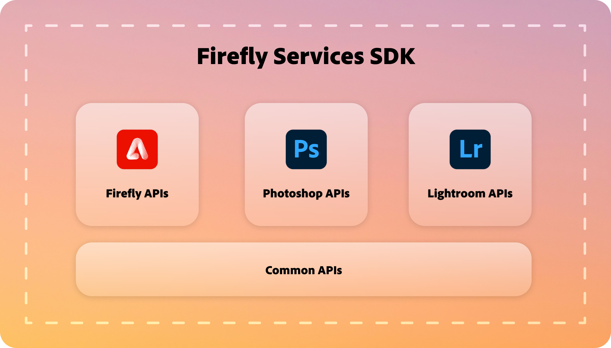

# Firefly Services SDK

Everything you need to know to get started with the Firefly Services SDK.

## Overview

The Firefly Services SDK is a comprehensive toolkit designed to streamline your integration with Firefly Services. Whether you're a seasoned developer or just starting, our SDK provides you with the necessary utilities and modules to easily integrate your applications with Firefly's powerful capabilities.

## Key features

- Lightweight wrapper: The SDK offers a lightweight wrapper that simplifies the integration process, allowing you to focus on building great applications. Our SDK saves you valuable time and effort by handling the complex implementation details.

- Unified API Access: The SDK adheres to a consistent design pattern, enhancing developer comprehension and interaction with diverse product services.

- TypeScript Support: Developed in TypeScript, the JS SDK enables developers to leverage TypeScript’s capabilities, such as static type-checking and code autocomplete.

- Common Utility Package: This API package offers a range of utility APIs, including authentication APIs, to facilitate interaction with various product services.

- Comprehensive Documentation: Each package within the SDK is accompanied by thorough documentation and sample code, aiding developers in quick initiation and effective utilization of the SDK. 

## Get started 

The SDK currently comprises of four main modules.  

- Common APIs 
- Firefly API
- Photoshop API
- Lightroom API

 

To begin, get your `clientId`, `clientSecret` from the [Developer Console](https://developer.adobe.com/console/home), follow the instructions provided in [getting started](../get-started.md) page for assistance. 

Once you have the `clientId`, `clientSecret`, you can use authentication APIs in the common package to generate server-to-server Access token for your application.

### Installation 

For detailed instructions, refer to the [`README`](https://github.com/Firefly-Services/firefly-services-sdk-js) and explore the [SDK API references](https://github.com/Firefly-Services/firefly-services-sdk-js?tab=readme-ov-file#firefly-services-sdk-packages) or use our [sample code](https://github.com/Firefly-Services/firefly-services-sdk-js/tree/main/examples/javascript) to quickly get started with integrating our SDK into your projects. 

The SDK is currently available for `Node.js` and `TypeScript`.
