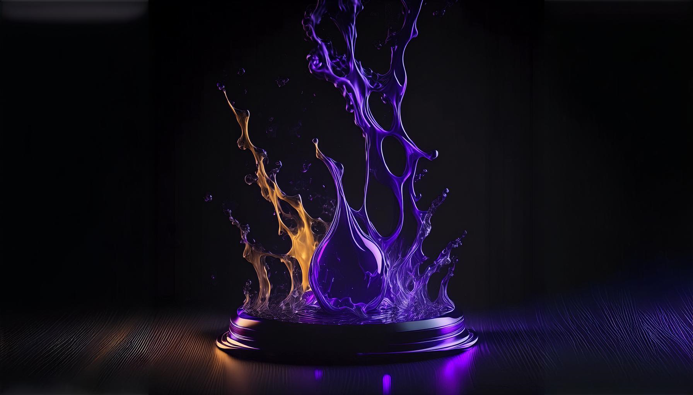
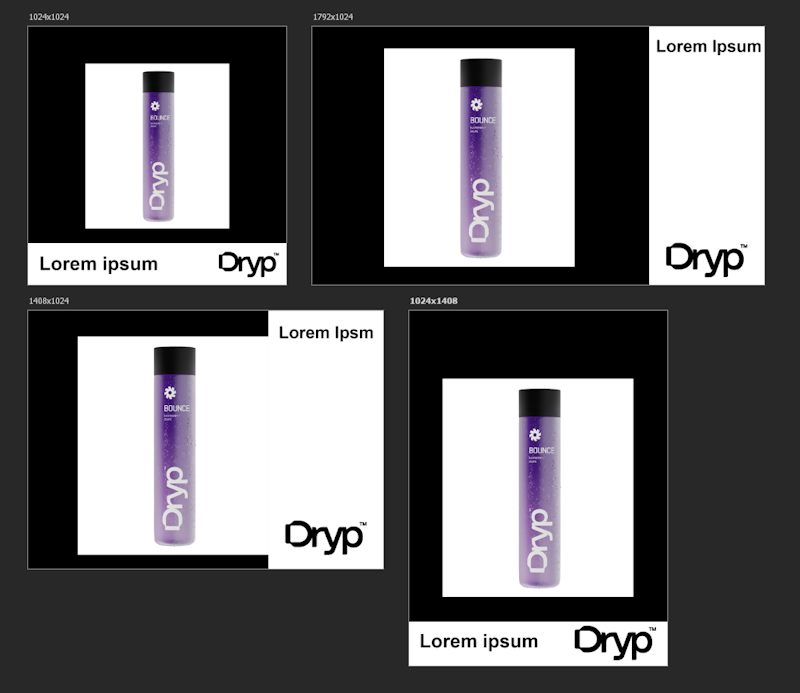
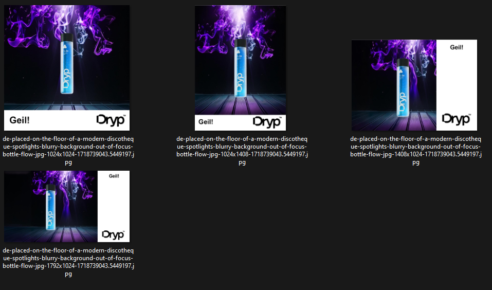

# Creating Product Images at Scale with Firefly Services

Discover how to generate images of different sizes, for various regional markets, and with different themes. Build workflows that combine product images, generative AI prompts, output sizes, and text copy translations to streamline content creation.

## Overview

Firefly Services encompass many APIs that allow for robust and complex workflows. One of the most valuable workflows possible supports content creation at scale. As a marketer, you may need to generate product images for:

* Different sizes
* Different regional markets
* Different themes

And so forth. When combined with multiple different products, the amount of collateral that could be needed can number in the tens of thousands. Let's consider a hypothetical workflow that demonstrates these capabilities in action.

* We start with a set of product images.
* We combine that with a set of generative AI prompts.
* We determine a list of desired output sizes.
* Finally, we have a set of text copy translations to accompany our output.

If we start with just three products but add two prompts, four sizes, and three translations, we need 3x2x4x3, or 72 different results. Let's look at what it would take to build such a workflow.

## Pre-requisites

Before attempting to run this demo yourself, you'll need a few things.

* You will need a set of credentials for Firefly Services. You can get those [here](../get-started.md).
* As part of the workflow, we use cloud storage to hold files the Photoshop API uses. For this demo, we used Dropbox, so you will need credentials to work with their API, including the app key, app secret, and refresh token. Python developers can find the Dropbox SDK [here](https://www.dropbox.com/developers/documentation/python).
* The code with Dropbox does all of its work under one folder named `FFProcess`. This is conveniently set as a variable that can be modified.
* This demo uses a few demo assets that will be described as the process is documented. Everything required to run this demo (minus credentials, of course) can be grabbed from this [zip file](/process.zip).
* The code in this demo uses Python, but any programming language can work with the REST APIs.

## The Workflow

Before digging into the code, let's break down the process.

1. Read Local Data Sets:
    * Read product images.
    * Define desired sizes.
    * Read prompts from a text file.
    * Read translations from a text file.
2. Get Access Token and Connect to Dropbox:
    * Obtain access token for Firefly Services.
    * Connect to Dropbox using credentials.
3. Remove Background from Product Images: For each product image, remove the background.
4. Generate Images Based on Prompts: For each prompt, generate an image.
5. Expand Images to Desired Sizes: For each prompt-generated image, expand to the desired sizes.
6. Use Photoshop API and PSD (Photoshop Document) template:
    * For each language and product shot:
        * Input resized images from step 5.
        * Input product without background from step 3.
        * Input text from prompts in the desired language from step 1.

## Step 1: Importing the dependencies

Our script begins by importing the required dependencies and reading in our credentials from the local environment.

```python
import os
import requests
import dropbox
from dropbox.files import CommitInfo, WriteMode
import time
from slugify import slugify

ff_client_id = os.environ.get('CLIENT_ID')
ff_client_secret = os.environ.get('CLIENT_SECRET')
db_refresh_token = os.environ.get('DROPBOX_REFRESH_TOKEN')
db_app_key = os.environ.get('DROPBOX_APP_KEY')
db_app_secret = os.environ.get('DROPBOX_APP_SECRET')
```

Next, we're going to set up a bunch of variables that the workflow will use:

```python
# Base folder to use in Dropbox
db_base_folder = "/FFProcess/"

# The output sizes
sizes = ["1024x1024","1792x1024","1408x1024","1024x1408"]

# Prompts
prompts = [line.rstrip() for line in open('input/prompts.txt','r')]

# Languages and translations
langs = [line.rstrip() for line in open('input/translations.txt','r')]
languages = []
for l in langs:
  language,text = l.split(',')
  languages.append({"language":language, "text":text})

# Products sources from a set of images.
products = os.listdir("input/products")
```

From the top:

* `db_base_folder` is used to supply a 'root' part of our cloud storage system that the code will use.
* `sizes` is a hard-coded list of required sizes.
* `prompts` is read from a local file. Here's how it looks in our sample:

```text
placed on a futuristic table, blue orange and neon cyberpunk backgrounds, gradients, blurry background out of focus
placed on the floor of a modern discotheque spotlights, blurry background, out of focus
```

* `langs` is a set of language codes and translations, also read from a local file:

```text
en,Awesome!
fr,Fantastique!
de,Geil!
```

* `products` is a list of files read from a subdirectory. Currently, we have three images of a product on a white background:


## Step 2: Connect to Firefly Services and Dropbox

As the rest of the code will need to access both Firefly and Dropbox, our code then needs to authenticate and get access tokens.

```python
# Connect to Firefly Services and Dropbox
dbx = dropbox_connect(db_app_key, db_app_secret, db_refresh_token)
ff_access_token = getFFAccessToken(ff_client_id, ff_client_secret)
print("Connected to Firefly and Dropbox APIs.")
```

Both of these functions are defined earlier in the script.

For Dropbox, here's our method:

```python
def dropbox_connect(app_key, app_secret, refresh_token):
  try:
    dbx = dropbox.Dropbox(app_key=app_key, app_secret=app_secret, oauth2_refresh_token=refresh_token)
  except AuthError as e:
    print('Error connecting to Dropbox with access token: ' + str(e))
  return dbx
```

This is pretty much straight from the documentation for the [Dropbox Python SDK](https://github.com/dropbox/dropbox-sdk-python).

For Firefly Services, the method looks like so:

```python
def getFFAccessToken(id, secret):
  response = requests.post(f"https://ims-na1.adobelogin.com/ims/token/v3?client_id={id}&client_secret={secret}&grant_type=client_credentials&scope=openid,AdobeID,firefly_enterprise,firefly_api,ff_apis")
  return response.json()['access_token']
```

The `client_id` and `client_secret` from our Firefly Services credentials are passed to the authentication endpoint and exchanged for an access token. The response includes other data, including the lifetime of the token, but for our needs, we just need the token.

## Step 3: Specify a reference image

Later in our workflow, we will use a prompt to generate a new image. However, we also want that image to be based on a source image. This is one of the powerful ways the Firefly API lets you guide the content it creates.

By using the [Upload image API](/firefly-api/guides/api/upload_image.md) endpoint, we can provide a source image for reference later.

Here's a utility method that wraps that endpoint:

```python
def uploadImage(path, id, token):
  
  with open(path,'rb') as file:

    response = requests.post("https://firefly-api.adobe.io/v2/storage/image", data=file, headers = {
      "X-API-Key":id,
      "Authorization":f"Bearer {token}",
      "Content-Type": "image/jpeg"
    })

    # Simplify the return a bit...
    return response.json()["images"][0]["id"]
```

Notice we're returning just the ID as that's all we'll need later. And here's how we call it from our script:

```python
referenceImage = uploadImage('input/source_image.jpg', ff_client_id, ff_access_token)
```

For our workflow, here's our source:


## Step 4: Remove background from product images with Photoshop API

Next up we need to take our source products and remove the background from each. The Photoshop API requires the use of cloud storage so this process will require three things:

* We need to upload our product to Dropbox
* We need to create a 'readable' link for that resource, a way for the Photoshop API to read in the image.
* We need to create a 'writable' link to give to Photoshop such that when it's done, it can store the result.

Let's begin with code that loops over the products:

```python
# We use this to remember where are product images w/ the backgrounds are stored.
rbProducts = {}
for product in products:
  
  # First, upload the source
  dropbox_upload(f"input/products/{product}", f"{db_base_folder}input")

  # Get a readable link for that
  readableLink = dropbox_get_read_link(f"{db_base_folder}input/{product}")

  # Make a link to upload the result
  writableLink = dropbox_get_upload_link(f"{db_base_folder}knockout/{product}")

  rbJob = createRemoveBackgroundJob(readableLink, writableLink, ff_client_id, ff_access_token)
  result = pollJob(rbJob, ff_client_id, ff_access_token)

  readableLink = dropbox_get_read_link(f"{db_base_folder}knockout/{product}")
  rbProducts[product] = readableLink
  # For now, we assume ok
```

For each product, we upload and create a link. As these methods just wrap calls to the Dropbox SDK we'll skip showing them here, but they are available in the full code below. Notice however we're storing the products in an `input` folder (beneath our base folder). To create the version without the background, we create a writeable link to the `knockout` folder.

Now that we have our product in the cloud storage, a link to that product, and a way to write the output, we can call the Photoshop [Remove Background API](https://developer.adobe.com/firefly-services/docs/photoshop/api/?aio_internal). This is done in a utility method that accepts both links and credential information:

```python
def createRemoveBackgroundJob(input, output, id, token):
  
  data = {
    "input": {
      "href":input,
      "storage":"dropbox"
    },
    "output":{
      "href":output,
      "storage":"dropbox"
    }
  }
  response = requests.post(f"https://image.adobe.io/sensei/cutout", headers = {"Authorization": f"Bearer {token}", "x-api-key": id }, json=data)
  return response.json()
```

Photoshop API calls are asynchronous and you can see in the loop shown above, we call another method, `pollJob`, to check for completion:

```python
def pollJob(job, id, token):
  jobUrl = job["_links"]["self"]["href"]
  status = ""
  while status != 'succeeded' and status != 'failed':

    response = requests.get(jobUrl, headers = {"Authorization": f"Bearer {token}", "x-api-key": id })
    json_response = response.json()

    if "status" in json_response:
      status = json_response["status"]
    elif "status" in json_response["outputs"][0]:
      status = json_response["outputs"][0]["status"]
      
    if status != 'succeeded' and status != 'failed':
      time.sleep(3)
    else:
      return json_response
```

This method will loop until a successful response has been returned. There's a bit of conditional logic to handle the different kinds of jobs run by Photoshop (our workflow will be calling another shortly), and as stated, we're assuming successful responses.

Before moving on, note again the last two lines in the loop:

```python
readableLink = dropbox_get_read_link(f"{db_base_folder}knockout/{product}")
rbProducts[product] = readableLink
```

Earlier our code made an empty Python object, `rbProducts`. The purpose of this is to create a collection of key/value pairs where the key represents a product and the value is a readable link to the version with the background removed.

One additional thing we do before moving on to Firefly is to create a readable link to our Photoshop template. This is already on Dropbox so we just need to get that link:

```python
# I'm using this later when generating final results.
psdOnDropbox = dropbox_get_read_link(f"{db_base_folder}genfill-banner-template-text-comp.psd")
```

## Step 5: Generate and expand images using Firefly API

Now we're beginning a rather large and complex loop, so we'll try to take it bit by bit. Don't forget the complete script may be found at the end of the article.

### Generate images based on prompts

First, we loop over each prompt (remember, this was sourced from a text file);

```python
for prompt in prompts:
```

Next, we generate an image for our prompt:

```python
  print(f"Generating an image with prompt: {prompt}.")
  newImage = textToImage(prompt, referenceImage, ff_client_id, ff_access_token)
```

Let's look at `textToImage`:

```python
def textToImage(text, imageId, id, token):

  data = {
    "numVariations":1,
    "prompt":text,
    "contentClass":"photo",
    "size":{
      "width":1024,
      "height":1024
    },
    "style":{
      "imageReference":{
        "source":{
          "uploadId":imageId
        }
      }
    }
  }

  response = requests.post("https://firefly-api.adobe.io/v3/images/generate", json=data, headers = {
    "X-API-Key":id,
    "Authorization":f"Bearer {token}",
    "Content-Type":"application/json"
  })

  return response.json()["outputs"][0]["image"]["url"]
```

This method is passed two main arguments (ignoring the credentials) - `text` and `imageId`, representing our prompt and reference image. You can see in `data` where these values are passed in. Finally, this is passed to the Firefly [Generate Images API](../../firefly-api/guides/api/image_generation/V3_Async/) API endpoint. The result, in this case the URL of the image, is returned.

### Expand images to desired sizes

After generating the image for the prompt, we then need to resize it once for each of our desired sizes. If you remember, our sizes were:

```python
sizes = ["1024x1024","1792x1024","1408x1024","1024x1408"]
```

However, our initial image was 1024x1024, so we get to skip that when generating our new sizes.

```python
  # I store a key from size to the image
  sizeImages = {}

  for (idx, size) in enumerate(sizes):
    # For each size, outside of our first, expand it
    if idx >= 1:
      print(f"Generating an expanded one at size {size}")
      expandedBackground = generativeExpand(newImage, size, ff_client_id, ff_access_token)
      sizeImages[size] = expandedBackground
    else:
      print(f"Using original for {size}")
      sizeImages[size] = newImage
```

This code is using another utility method, `generativeExpand`:

```python
def generativeExpand(imageUrl, size, id, token):

  width, height = size.split('x')

  data = {
    "numVariations":1,
    "image":{
      "source":{
        "url":imageUrl
      }
    },
    "size":{
      "width":width,
      "height":height
    }
  }

  response = requests.post("https://firefly-api.adobe.io/v3/images/expand", json=data, headers = {
    "X-API-Key":id,
    "Authorization":f"Bearer {token}",
    "Content-Type":"application/json"
  })

  return response.json()["outputs"][0]["image"]["url"]
```

This method wraps the [Generative Expand API](../../firefly-api/guides/api/generative_expand/V3_Async/). It needs both the image resource to expand (which we got from the initial Generate Image API prompt) and the desired size. In this case, we need a link to the result so the URL is returned.
As an example, given the prompt "placed on a futuristic table, blue orange and neon cyberpunk backgrounds, gradients, blurry background out of focus", the original Firefly generated image was expanded for all four sizes. Here are two examples:




## Step 6: Generate final product images

We're almost there! Remember that we're inside a loop based on our prompt. We generated a new image based on the prompt and then expanded it to a list of sizes. The final section of the workflow will do the following:

We will reference a Photoshop template for cloud storage as a one-time operation. This PSD has four different blocks that match up with our desired sizes. It has layers for the products in each desired size and a text layer with default text. Here's how that PSD:



The PSD was already uploaded to our Dropbox folder and we shared earlier in the tutorial the code to get the readable link.
With that template in place, we can use the Photoshop API to dynamically replace the background, product, and text in each of the sized boxes. Here's that loop:

```python
  for lang in languages:
    
    for product in products:
      
      print(f'Working with language {lang["language"]} and {product}')

      outputUrls = []

      for size in sizes:
        width, height = size.split('x')
        outputUrls.append(dropbox_get_upload_link(f"{db_base_folder}output/{lang['language']}-{slugify(prompt)}-{slugify(product)}-{width}x{height}-{theTime}.jpg"))

      result = createOutput(psdOnDropbox, rbProducts[product], sizes, sizeImages, outputUrls, lang["text"], ff_client_id, ff_access_token)
      print("The Photoshop API job is being run...")
      finalResult=pollJob(result, ff_client_id, ff_access_token)
```

Inside our two loops, we first have to figure out where the Photoshop API is going to save its results. For this, we create a link to a resource inside the `output` folder of our Dropbox storage that contains:

* The current language
* The current prompt
* The current product
* The size
* And the time (the variable `theTime` was set earlier in our script and simply references the current date and time)

This data is stored in an array, `outputUrls`. We can then call our method, `createOutput`, passing:

* The reference to the PSD shown earlier
* The readable link of the product with the background removed
* Our sizes
* The resized generatively expanded images
* Our desired output
* The text to use in the text layer
* And credentials of course.

Let's look at that method:

```python
def createOutput(psd, koProduct, sizes, sizeUrls, outputs, text, id, token):

  data = {
    "inputs": [{
      "href":psd,
      "storage":"dropbox"
    }],
    "options":{
      "layers":[
      ]
    },
    "outputs":[]
  }

  for (x,size) in enumerate(sizes):
    width, height = size.split('x')
    url = sizeUrls[size]
    data["options"]["layers"].append({
      "name":f"{width}x{height}-text",
      "edit":{},
      "text":{
        "content":text
      }
    })

    data["options"]["layers"].append({
      "name":f"{width}x{height}-background",
      "edit":{},
      "input":{
        "storage":"external",
        "href":url
      }
    })

    data["options"]["layers"].append({
      "name":f"{width}x{height}-product",
      "edit":{},
      "input":{
        "storage":"external",
        "href":koProduct
      }
    })

    data["outputs"].append({
      "href":outputs[x],
      "storage":"dropbox",
      "type":"image/jpeg",
      "trimToCanvas":True,
      "layers":[{
        "name":f"{width}x{height}"
      }]
  
    })

  response = requests.post(f"https://image.adobe.io/pie/psdService/documentOperations", headers = {"Authorization": f"Bearer {token}", "x-api-key": id }, json=data)
  return response.json()
```

This is a reasonably hefty method. As a whole, this code wraps calls to the [Apply PSD Edits](https://developer.adobe.com/firefly-services/docs/photoshop/api/?aio_internal) Photoshop API.

It creates a reasonably large JSON object that includes information on the new images for backgrounds and products.

It also passes information about the text layers. Lastly, it adds a set of output values that map to the `sized` layers containing our results. What's incredible is that all of this is handled in a straightforward call while generating multiple results.

As mentioned earlier, each run of this process should create 72 unique images. Here's one set of four sizes for one product, prompt, and language:



## Wrap Up

What you've seen here is a fairly complex, but absolutely realistic example of the kind of workflows that Firefly Services can help organizations with. Generating marketing images at scale can save a tremendous amount of time and cost. Here's the complete script:

```python
import os
import requests
import dropbox
from dropbox.files import CommitInfo, WriteMode
import time
from slugify import slugify

ff_client_id = os.environ.get('CLIENT_ID')
ff_client_secret = os.environ.get('CLIENT_SECRET')
db_refresh_token = os.environ.get('DROPBOX_REFRESH_TOKEN')
db_app_key = os.environ.get('DROPBOX_APP_KEY')
db_app_secret = os.environ.get('DROPBOX_APP_SECRET')

# Base folder to use in Dropbox
db_base_folder = "/FFProcess/"

# The output sizes
sizes = ["1024x1024","1792x1024","1408x1024","1024x1408"]

# Prompts
prompts = [line.rstrip() for line in open('input/prompts.txt','r')]

# Languages and translations
langs = [line.rstrip() for line in open('input/translations.txt','r')]
languages = []
for l in langs:
  language,text = l.split(',')
  languages.append({"language":language, "text":text})

# Products sources from a set of images.
products = os.listdir("input/products")

def createRemoveBackgroundJob(input, output, id, token):
  
  data = {
    "input": {
      "href":input,
      "storage":"dropbox"
    },
    "output":{
      "href":output,
      "storage":"dropbox"
    }
  }
  response = requests.post(f"https://image.adobe.io/sensei/cutout", headers = {"Authorization": f"Bearer {token}", "x-api-key": id }, json=data)
  return response.json()

def pollJob(job, id, token):
  jobUrl = job["_links"]["self"]["href"]
  status = ""
  while status != 'succeeded' and status != 'failed':

    response = requests.get(jobUrl, headers = {"Authorization": f"Bearer {token}", "x-api-key": id })
    json_response = response.json()

    if "status" in json_response:
      status = json_response["status"]
    elif "status" in json_response["outputs"][0]:
      status = json_response["outputs"][0]["status"]
      
    if status != 'succeeded' and status != 'failed':
      time.sleep(3)
    else:
      return json_response

def dropbox_connect(app_key, app_secret, refresh_token):
  try:
    dbx = dropbox.Dropbox(app_key=app_key, app_secret=app_secret, oauth2_refresh_token=refresh_token)
  except AuthError as e:
    print('Error connecting to Dropbox with access token: ' + str(e))
  return dbx

def dropbox_upload(f, folder):
    newName = folder + '/' + f.split('/')[-1]
    with open(f,'rb') as file:
      dbx.files_upload(file.read(), newName)

def dropbox_get_read_link(path):
  link = dbx.sharing_create_shared_link(path).url
  return link.replace("dl=0","dl=1")

def dropbox_get_upload_link(path):
  commit_info = CommitInfo(path=path, mode=WriteMode.overwrite)
  return dbx.files_get_temporary_upload_link(commit_info).link
def getFFAccessToken(id, secret):
  response = requests.post(f"https://ims-na1.adobelogin.com/ims/token/v3?client_id={id}&client_secret={secret}&grant_type=client_credentials&scope=openid,AdobeID,firefly_enterprise,firefly_api,ff_apis")
  return response.json()['access_token']

def createOutput(psd, koProduct, sizes, sizeUrls, outputs, text, id, token):

  data = {
    "inputs": [{
      "href":psd,
      "storage":"dropbox"
    }],
    "options":{
      "layers":[
      ]
    },
    "outputs":[]
  }

  for (x,size) in enumerate(sizes):
    width, height = size.split('x')
    url = sizeUrls[size]
    data["options"]["layers"].append({
      "name":f"{width}x{height}-text",
      "edit":{},
      "text":{
        "content":text
      }
    })

    data["options"]["layers"].append({
      "name":f"{width}x{height}-background",
      "edit":{},
      "input":{
        "storage":"external",
        "href":url
      }
    })

    data["options"]["layers"].append({
      "name":f"{width}x{height}-product",
      "edit":{},
      "input":{
        "storage":"external",
        "href":koProduct
      }
    })

    data["outputs"].append({
      "href":outputs[x],
      "storage":"dropbox",
      "type":"image/jpeg",
      "trimToCanvas":True,
      "layers":[{
        "name":f"{width}x{height}"
      }]
  
    })

  response = requests.post(f"https://image.adobe.io/pie/psdService/documentOperations", headers = {"Authorization": f"Bearer {token}", "x-api-key": id }, json=data)
  return response.json()

def uploadImage(path, id, token):
  
  with open(path,'rb') as file:

    response = requests.post("https://firefly-api.adobe.io/v2/storage/image", data=file, headers = {
      "X-API-Key":id,
      "Authorization":f"Bearer {token}",
      "Content-Type": "image/jpeg"
    })

    # Simplify the return a bit...
    return response.json()["images"][0]["id"]
def textToImage(text, imageId, id, token):

  data = {
    "numVariations":1,
    "prompt":text,
    "contentClass":"photo",
    "size":{
      "width":1024,
      "height":1024
    },
    "style":{
      "imageReference":{
        "source":{
          "uploadId":imageId
        }
      }
    }
  }

  response = requests.post("https://firefly-api.adobe.io/v3/images/generate", json=data, headers = {
    "X-API-Key":id,
    "Authorization":f"Bearer {token}",
    "Content-Type":"application/json"
  })

  return response.json()["outputs"][0]["image"]["url"]

def generativeExpand(imageUrl, size, id, token):

  width, height = size.split('x')

  data = {
    "numVariations":1,
    "image":{
      "source":{
        "url":imageUrl
      }
    },
    "size":{
      "width":width,
      "height":height
    }
  }

  response = requests.post("https://firefly-api.adobe.io/v3/images/expand", json=data, headers = {
    "X-API-Key":id,
    "Authorization":f"Bearer {token}",
    "Content-Type":"application/json"
  })

  return response.json()["outputs"][0]["image"]["url"]
# Connect to Firefly Services and Dropbox
dbx = dropbox_connect(db_app_key, db_app_secret, db_refresh_token)
ff_access_token = getFFAccessToken(ff_client_id, ff_client_secret)
print("Connected to Firefly and Dropbox APIs.")

referenceImage = uploadImage('input/source_image.jpg', ff_client_id, ff_access_token)
print("Reference image uploaded.")

# We use this to remember where are product images w/ the backgrounds are stored.
rbProducts = {}
for product in products:
  
  # First, upload the source
  dropbox_upload(f"input/products/{product}", f"{db_base_folder}input")

  # Get a readable link for that
  readableLink = dropbox_get_read_link(f"{db_base_folder}input/{product}")

  # Make a link to upload the result
  writableLink = dropbox_get_upload_link(f"{db_base_folder}knockout/{product}")

  rbJob = createRemoveBackgroundJob(readableLink, writableLink, ff_client_id, ff_access_token)
  result = pollJob(rbJob, ff_client_id, ff_access_token)

  readableLink = dropbox_get_read_link(f"{db_base_folder}knockout/{product}")
  rbProducts[product] = readableLink
  # For now, we assume ok
# I'm using this later when generating final results.
psdOnDropbox = dropbox_get_read_link(f"{db_base_folder}genfill-banner-template-text-comp.psd")

theTime = time.time()
for prompt in prompts:
  
  # For each prompt, generate a new background using prompt and reference
  print(f"Generating an image with prompt: {prompt}.")
  newImage = textToImage(prompt, referenceImage, ff_client_id, ff_access_token)

  # I store a key from size to the image
  sizeImages = {}

  for (idx, size) in enumerate(sizes):
    # For each size, outside of our first, expand it
    if idx >= 1:
      print(f"Generating an expanded one at size {size}")
      expandedBackground = generativeExpand(newImage, size, ff_client_id, ff_access_token)
      sizeImages[size] = expandedBackground
    else:
      print(f"Using original for {size}")
      sizeImages[size] = newImage
  for lang in languages:
    
    for product in products:
      
      print(f'Working with language {lang["language"]} and {product}')

      outputUrls = []

      for size in sizes:
        width, height = size.split('x')
        outputUrls.append(dropbox_get_upload_link(f"{db_base_folder}output/{lang['language']}-{slugify(prompt)}-{slugify(product)}-{width}x{height}-{theTime}.jpg"))

      result = createOutput(psdOnDropbox, rbProducts[product], sizes, sizeImages, outputUrls, lang["text"], ff_client_id, ff_access_token)
      print("The Photoshop API job is being run...")
      finalResult=pollJob(result, ff_client_id, ff_access_token)

print("Done.")
```
