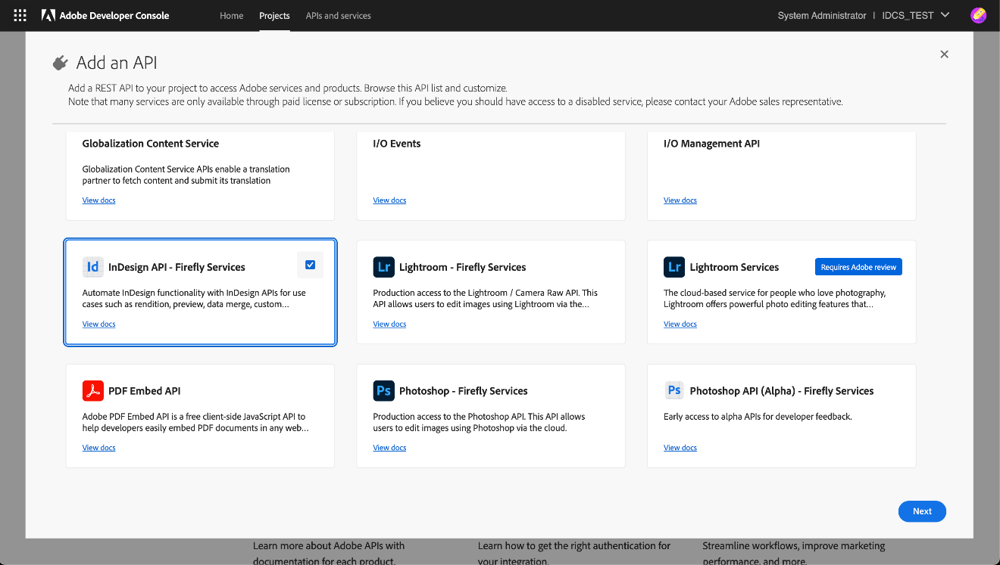

# InDesign API Key Concepts

Consider these important concepts when using InDesign APIs.

## Adobe Developer Console

### Overview

The **Adobe Developer Console** is an administration interface that
enables developers to manage Adobe's APIs and services. To securely
access Adobe's APIs, including the InDesign API, your application must
authenticate using OAuth 2.0 protocols. This involves obtaining an
access token that grants your application permissions to interact with
Adobe's services.

**You will need:**

- An [Adobe Developer Console][1] account.

- A [project][2] with Firefly API [OAuth Server-to-Server credentials set
  up][3].

- Add and configure **InDesign API Firefly Services** to your new project.

- Access to your Client ID and Client Secret from the Developer Console.



### Access tokens

You can [generate access tokens][4] either directly from the Developer Console UI or programmatically.

### Best practices

- **Token management:** Access tokens are valid for 24 hours. Implement a mechanism to refresh tokens before they expire to maintain uninterrupted access.

- **Scope limitation:** Request only the scopes necessary for your
  application's functionality to adhere to the principle of least
  privilege.

- **Secure storage:** Store your Client ID, Client Secret, and access tokens securely to prevent unauthorized access.

## Pre-signed URLs

### What is a pre-signed URL?

A pre-signed URL is a URL that grants temporary access to a specific resource, typically in cloud storage, with predefined permissions and an expiration time. It allows users to upload or download files securely
without needing direct access to the storage service's credentials.

While using InDesign APIs, the input and output assets are stored as pre-signed URLs.

### Input assets

The platform supports multiple asset types for input. These asset types indicate storage repositories from which the platform can download. You can provide the input asset information within the `assets` array.

InDesign APIs support the following input assets:

- **AWS S3**: [Use a pre-signed GET/PUT/POST URL.][5]

- **Dropbox**: [Generate temporary upload/download links.][6]

- **Azure**: [Use a Shared Access Signature (SAS) in Azure Storage][7] for GET/PUT/POST operations.

```json
"assets" :[
    {
        "source" : {
            "storageType" : "Azure", //Optional
            "url" : "https://xyz-blob.core.windows.net/Template.indt"
        },
        "destination" : "jobasset/template1.indt"
    },
    {
        "source" : {
            "storageType" : "Aws", //Optional
            "url" : "https://s3.eu-west-1.amazonaws/xyz/Template.indt"
        },
        "destination" : "jobasset/template2.indt"
    }
]
```

In the examples above, you can see that data is divided into `source` and `destination`.

The `source` attribute is where the asset is downloaded from. The `destination` attribute refers to where the asset would be downloaded to.

### Output assets

The platform supports multiple asset types for output. These asset types signify storage repositories to which the
platform can upload. You can provide this information in the `outputs` array within the body of the request.

```json
"outputs": [
    {
        "destination" : {
            "type" : "Azure",
            "url" : "https://xyz-blob.core.windows.net/Template.indt"
        },
        "source" : "jobasset/template.indt"
    }
]
```

Each storage provider may have its own requirements for creating PUT or POST pre-signed URLs. Please follow the documentation from the individual storage provider creating these URLs.

## About custom script bundles

To create a script to use with the Custom Scripts API, you'll need to prepare a script bundle, a ZIP file with a predefined structure.

### Custom script bundle structure

The structure for a simple custom script bundle would look like this:

```plaintext
custom-script-folder
|------ manifest.json
|------ script.js
```

|File|Description|Required|
|---|---|---|
|manifest.json|The custom script manifest. All the details of the script are described in this file.|X|
|script.js|The primary executable for the script. This script gets executed by the product script engine and, depending on the product script engine support, it can depend on other files in nested directories in the ZIP file.|X|

### Custom Script manifest

The manifest file is a plain JSON file with the following structure:

```json
{
    "manifestVersion": "1.0.0",
    "id": "<Unique ID for the custom script>",
    "name": "<Name of the custom script>",
    "version": "<x.y.z>",
    "host": {
        "app": "indesign",
        "minVersion": "17.0.0",
        "maxVersion": "99.9.9"
    },
    "apiEntryPoints": [
        {
            "type": "capability",
            "path": "script.js",
            "language": "extendscript"
        }
    ]
}
```

| Field | Type | Description | Required |
|-------|------|-------------|----------|
| `manifestVersion` | string | The version of the manifest file format. Currently, only 1.0.0 is supported. | X |
| `name` | string | The name of the custom script. The custom script can be invoked using this. It should be between 4-255 characters. It must not have any white space. | X |
| `version` | string | The version number of the custom script, in x.y.z format. The version must be three segments and each version component must be between 0 and 99. | X |
| `host.app` | string | The host application would be used to execute this script. Currently, the only valid value is `indesign`. | X |
| `host.minVersion` | string | The minimum required version of the host app that can run this plugin, in x.y format. The version number must be two segments. Typically, the minor segment will be always set to 0 (e.g., 17.0). | X |
| `host.maxVersion` | string | The maximum version of the host app that can run this plugin. Use the same formatting as `host.minVersion`. |  |
| `apiEntryPoints` | array | An array of `<EntryPointDefinition>` objects. Describes the API entry points for the custom script. |  |

### The `apiEntryPoints` field

In the manifest file, the `apiEntryPoints` attribute is an array of `EntryPointDefinition` objects with the following format:

|Field|Type|Description|Required|
|---|---|---|---|
|`type`|string|The type of entry point. Valid values are `capability`.|X|
|`path`|string|The file path should be used based on the type. The default is to look for the files in the root directory of the ZIP file. However, this can also be any nested path in the ZIP file.|X|
|`language`|string|The language of the script. It can be an extended script, UXP script, or JavaScript.||

- Each entry point specifies a custom script or a custom script specification.
- There can be only one entry of each type in the array.
- The maximum size of the array is 3.

There's no need to define an entry point if the default values are being used for them.

### The `script.js` file

The script's author defines the custom attributes and values for a particular endpoint using *script.js* file in the custom script bundle.

The execution of any script depends on the following attributes:

| Attribute | Input Request Mapping | Description |
| --- | --- | --- |
| `assets` | assets->destination field | This contains a list of input assets, like .indd, .pdf, .jpeg, etc. |
| `params` | params | User input/arguments that are used inside script. |
| `jobID` | Auto-generated | The job ID. |
| `workingFolder` | Auto-generated | The working folder for the job. This is the base directory. Inside this directory, all the assets and scripts are downloaded. (for example c:\\baseFolder\\assets). |

For examples, see [Writing Scripts for the Custom Scripts API][8].

### Zipping and updating a custom script bundle

When zipping the files, don't place them inside a folder first. Instead, directly select the files and create the ZIP. This way when it's unzipped the files will appear directly instead of appearing inside a folder.

The custom script bundle can be updated by incrementing the version in the script manifest. The updated ZIP bundle can be uploaded using the submission endpoint.

## InDesign links support

 The InDesign APIs support links to content within the same document or across different documents. This helps keep the assets and the document decoupled.

To handle links, a temporary folder/directory, called the working directory, is created to process a request. All the input assets mentioned in the request are downloaded and kept in the working directory.

Within the working directory, the location of individual assets is governed by the relative path mentioned in the `destination` attribute. Note that the value mentioned in the destination property must be used to refer to the same asset in the rest of the parameters.

Links can work in two ways:

- Maintain relative paths of assets to the target document. To do this, place the files outside the working directory.

- If you place the linked assets parallel to the target document, the links get resolved, and the assets will be picked.

When documents contain custom links that InDesign does not understand, the custom URLs can be relinked to assets provided in the request.

### Relink example

In the example below, the existing URI `"customScheme:4c189e2d-315e-4fab-a8c2-45690e44d1f0"` in the document `"TargetDocument.indd"` cannot be interpreted by InDesign. The caller would have provided an input asset with the `"destination"` attribute as `"SomeAsset.png"`.

In this example the caller is asking the specified URI to be relinked to the new asset, which is present at `<Working_Directory>/SomeNewAsset.png`.

```json
{
    "params": {
        "generalSettings": {
            "links": {
                "replaceLinks": [
                    {
                        "targetDocument": "TargetDocument.indd",
                        "mapping": [
                            {
                                "currentURI": "customScheme:4c189e2d-315e-4fab-a8c2-45690e44d1f0",
                                "newAssetRelativePath": "SomeNewAsset.png"
                            }
                        ]
                    }
                ]
            }
        }
    }
}
```

## Using custom fonts

Custom fonts or user fonts can be provided as a regular asset.

```json
{

    "assets":[
        {
            "source": {
                "url":"<YOUR PRE-SIGNED URL>",
                "type":"HTTP_GET"
            },
            "destination" : "Cheese_final.indd"
        },
        {
            "source": {
                "url":"<YOUR PRE-SIGNED URL>",
                "type":"HTTP_GET"
            },
            "destination" : "FontName.otf"
        }
    ]
}
```

### Best practices with fonts

For fonts to be found by default, please place them in the "Document Fonts" folder parallel to the document that uses them.

By keeping the fonts in the "Document Fonts" folder parallel to indivdual documents, you can avoid adding any font directory and get a more optimized performance (see below).

```json
{
  "params": {
    "generalSettings": {
      "fonts": {
        "fontsDirectories": []
      }
    }
  }
}

```

Or, if the fonts are kept in some other folder (for example, `fontFolder`), please specify the correct font directory:

```json
{
    "params": {
        "generalSettings": {
            "fonts": {
                "fontsDirectories": [
                    "fontFolder"
                ]
            }
        }
    }
}
```

When font directories are added, don't use them with InDesign documents because opening these files will create additional lock files and trigger recalculation of the font resources.

## Pagination

Some list-style responses support pagination using the `page` and `size` query parameters. When multiple pages are available, the response includes a `paging` object with navigation URLs.

For example in case of Pagination is status api, the response also includes:
```json
"paging": {
  "prevUrl": "https://indesign.adobe.io/v3/status/<job_id>?size=10&page=0",
  "nextUrl": "https://indesign.adobe.io/v3/status/<job_id>?size=10&page=2"
}
```

- **prevUrl**: Present when a previous page exists.
- **nextUrl**: Present when a next page exists.
- If a direction is not applicable, its URL is omitted from the response.

## Using webhooks

InDesign APIs events provide job processing details similar to
those shown in the status calls of InDesign APIs. However, InDesign API events are more comprehensive.

Please refer to the [InDesign APIs Webhooks][9]
for a detailed guide on setting up webhooks.

[1]: https://developer.adobe.com/
[2]: https://developer.adobe.com/developer-console/docs/guides/projects/projects-empty/
[3]: https://developer.adobe.com/developer-console/docs/guides/services/services-add-api-oauth-s2s/
[4]: https://developer.adobe.com/developer-console/docs/guides/services/services-add-api-oauth-s2s/#api-overview
[5]: https://docs.aws.amazon.com/AmazonS3/latest/userguide/Welcome.html
[6]: https://dropbox.github.io/dropbox-api-v2-explorer/
[7]: https://learn.microsoft.com/en-us/azure/storage/
[8]: ../how-tos/writing-scripts-for-custom-scripts-api/index.md
[9]: https://developer.adobe.com/events/docs/guides/using/indesign-apis/indesign-apis-events-data-stream-setup/
