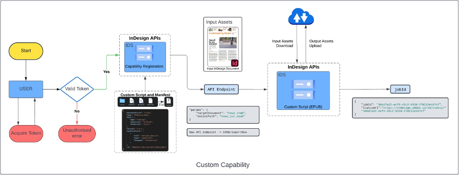
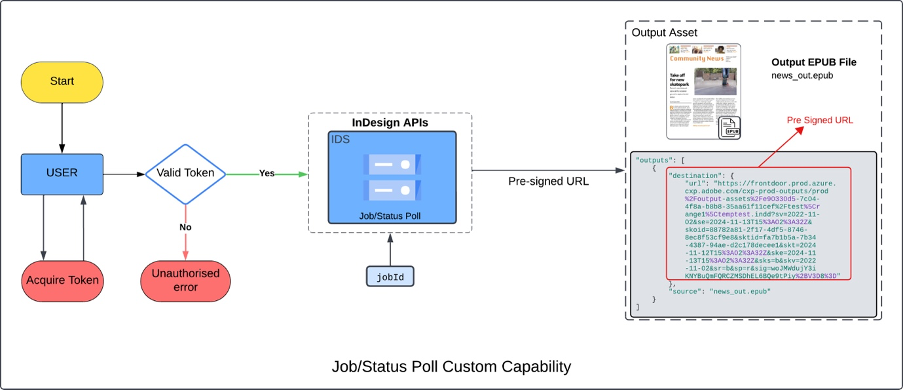

# Working with the Custom Capabilities API

With the Custom Capabilities API, register [custom capabilities that you've scripted](../writing-custom-scripts-for-capability-api%20/) with the API. Then use those custom capabilities on documents by referencing the `{CAPABILITY_ID}`.

## Before you start

- You'll need [a valid access token and client ID](../../concepts/#access-tokens).

In the cURL commands, be sure to:

-  Update the `Authorization` with the bearer access token.
-  Update `x-api-key` with the client ID.
-  Update `x-gw-ims-org-id` with your organization ID.
  
## Register a custom capability



New custom capabilities get registered by making a POST call to the API.

### Quickstart

Use this cURL command to register a custom capability.
Be sure to update the `{YOUR_CUSTOM_SCRIPT_ZIP}` with the [path to your custom script](/how-tos/writing-custom-scripts-for-capability-api/).

```curl
curl --request POST \
--url https://indesign.adobe.io/v3/capability \
--header 'Authorization: Bearer {YOUR_OAUTH_TOKEN}' \
--header 'x-api-key: {YOUR_API_KEY}' \
--header 'Content-Type: multipart/form-data' \
--header 'x-gw-ims-org-id: {YOUR_ORG_ID}' \
--form file=@{YOUR_CUSTOM_SCRIPT_ZIP}
```

In the response, you'll receive a `{CAPABILITY_ID}`.

**Example response**

```json
{
  "url": "https://indesign.adobe.io/v3/{CAPABILITY_ID}/sample-execution",
  "capability": "sample-execution",
  "version": "1.0.0"
}
```

## Execute a custom capability



Assets specified in the execution request are downloaded on the
local file system using the specified identifiers. The capability script
should be authored to work against locally downloaded assets.

The execution request can include a JSON dictionary as a parameter.
The capability defines the parameters and passes as is
to it during execution

The generated output uploads to the target location. If no location is provided,
the assets upload to temporary storage.

Each execution request is an asynchronous operation for which the status can be
fetched using the [Status API](../../api/status.md). A link with expiry is provided in the execution status.

### Quickstart

Use this cURL command to run a custom capability on a document.

```curl
curl --request POST \
--url https://indesign.adobe.io/v3/{CAPABILITY_ID}/sample-execution \
--header 'Authorization: Bearer {YOUR_OAUTH_TOKEN}' \
--header 'Content-Type: application/json' \
--header 'x-api-key: {YOUR_API_KEY}' \
--header 'x-gw-ims-org-id: {YOUR_ORG_ID}' \
--data-raw '{
  "assets": [
    {
      "source": {
        "url": "{YOUR_PRE-SIGNED_URL}"
      },
      "destination": "sample.indd"
    }
  ],
  "params": {
    "targetDocument": "sample.indd",
    "outputPath": "converted.idml"
  }
}'

```

**Example response**

```json
{ 

"jobId": "9b9d00c5-8659-4766-8430-ed0a1c9bd87d", 

"statusUrl": "https://indesign.adobe.io/v3/status/9b9d00c5-8659-4766-8430-ed0a1c9bd87d" 

} 
```
